# Urna Electrónica

[//]: # "Institución educativa, líder del proyecto e integrantes del equipo."
[//]: # ""

  

# Universidad de Xalapa
***  

> "Sin libertad, la democracia es despotismo, sin democracia la libertad es una quimera." -- Octavio Paz.

***
****** 
## Integrantes:
  - Álvarez Castillo Miguel
  - Jarquin Morales Natalia
  - Jiménez Ponce Norma Inés
  - Morales Martínez Zain Aziel
  - Reyes Vázquez Brenda
  - Aguilar Justo Adan Enrique

******

# Introducción

Algunos de los aspectos fundamentales del voto dentro de las democracias y en especial en nuestro país, es que sea libre y secreto. El proceso
de votación le permite al ciudadano mexicano ejercer su máximo derecho de participación en la vida política, cívica y comunitaria del país. Sin embargo, las jornadas electorales son muy complejas y requieren de un especial cuidado durante cada momento del proceso para lograr cumplir con los aspectos característicos
del voto; por lo tanto, estas jornadas exigen mucho tiempo. Dado que la tecnología es una herramienta que facilita muchas actividades ayudándonos a realizarlas de manera óptima y eficaz, la tecnología se ha agregado en el proceso de votación y de esta manera se ha pensado en implementar una urna electrónica que permita el registro de los votos durante las jornadas electorales.

La urna electrónica es un dispositivo que permite recibir los votos emitidos por los ciudadanos y los contabiliza de manera automática [1]. De este modo, la urna elimina el conteo manual de votos y consigo los posibles errores que se  pudieran generar en este conteo manual, aumenta la participación de la ciudadanía, además de que contribuye a la conservación del medio ambiente, ya que esta urna es reusable.

En la actualidad con el avance de las tecnologías muchos países están en proceso de implementar nuevos mecanismos para dicho proceso, como la creación de urnas electrónicas.
Algunos países como Estados Unidos, Gran Bretaña, Suiza, Holanda, Estonia, Venezuela, Brasil, India y Francia, entre otros, han implementado diversos mecanismos para que de esta forma los ciudadanos tengan más confianza respecto a los procesos electorales. El término “e-voting” hace referencia a todo tipo de votación que implique el uso de medios electrónicos; en Alemania, las urnas electrónicas han sido utilizadas por más de diez años, pero todo esto terminó cuando la corte dictó que el uso de las urnas electrónicas quedaba prohibido ya que en 2005 los equipos presentaron problemas, el más importante fue que los equipos no le ofrecían al ciudadano un comprobante que verificara que su voto había sido emitido, esto hizo que los ciudadanos desconfiaran totalmente de la máquina.

Como resultado en este trabajo, se obtiene el diseño de un prototipo detallado de una urna electrónica funcional y segura. Se muestran las especificaciones de todos los componentes que conformarían el hardware de la urna, así mismo se mencionan los detalles del software, por consiguiente, es posible ensamblar y programar la urna electrónica que se propone en este documento.

Esta urna electrónica diseñada por alumnos de la Universidad de Xalapa, toma como base la cuarta generación de la urna electrónica de Jalisco, sin embargo, las tecnologías utilizadas y planteadas para el prototipo son actuales y con un gran margen de escalamiento:

Para el sofware se eligieron las siguientes tecnologías, que son usadas por las FANG (Facebook, Amazon, Netflix, Google):

> - Lenguaje de programación python, que es de propósito general y permite desarrollar aplicaciones de manera rápida y eficiente.
> - Manejador de base de datos postgres, que es robusto y escalable.
> - Diseño del sistema utilizando modelos UML, que permiten una documentación rápida y descriptiva del proyecto.

El hardware utilizado es:
|  | | 
| --- | --- | 
|Pantalla para Testigo  | Este es un monitor también conocido como pantalla, esta se encarga de mostrar la información del equipo, por ejemplo imágenes y texto; todas las imágenes en una pantalla son mostradas a través de pixeles, esto hace que la resolución de una pantalla dependa de la cantidad de pixeles que tenga.        |
|Pantalla táctil para principal   | Una pantalla táctil es un dispositivo de entrada y salida de información y este recibe órdenes con el tacto de un objeto como lo puede ser el dedo de una persona.        |
|Impresora térmica |Una impresora térmica es un tipo de dispositivo de impresión que usa el calor para poder mostrar la imagen o texto en papel lo que hace que no necesite de tinta lo que hace que sea menos cotoso su uso sin embargo para poder imprimir necesita tener papel térmico. |
|Lector de tarjetas | Es un dispositivo capaz de leer la información de una tarjeta sin tener que registrar los datos de manera manual haciendo que la lectura de información sea más rápida. |
|UPS | Un UPS (Uninterruptable Power Supply) en español se conoce como sistema de alimentación interrumpida, este dispositivo permite que un dispositivo eléctrico siga funcionando cuando el suministro de energía falle. |
| Computadora | Es un dispositivo que se usa para realizar tareas de manera digital, ahorrando tiempo, trabajo y velocidad en la realización de los trabajos. |

# Objetivos

> ## Objetivo General:
> * Desarrollar un prototipo eficaz innovador y funcional de urna electrónica, para que los ciudadanos puedan votar de una manera fácil, eficiente y segura. Enfocado para distintos tipos de elecciones, además de generar confianza en la ciudadanía.

> ## Objetivos específicos:
> * Proceso de votación fácil de comprender y realizar para el usuario.
> * Acortar el tiempo del proceso de votación.
> * Eliminar el conteo manual de votos.
> * Disminuir los costos que son generados por las boletas de papel utilizadas en las votaciones convencionales. 
> * Reducir el tiempo destinado a las capacitaciones de funcionarios de casilla.
> * Satisfacción en la ciudadanía al realizar el voto electrónico
> * Prototipo dentro del presupuesto dado.
> * Fomentar el voto electrónico.

# Glosario
  - **Autenticación**: Proceso de confirmación que algo es quien dice ser.
  - **Computadora**: Máquina electrónica digital programable que ejecuta una serie de comandos para procesar los datos de entrada.
  - **E-voting**: Voto a distancia a través de internet
  - **Framework**: Es un conjunto estandarizado de conceptos, prácticas y criterios para enfocar un tipo de problemática particular que sirve como referencia, para enfrentar y resolver nuevos problemas de índole similar.
  - **GUI**: Programa informático que actúa de interfaz de usuario, utilizando un conjunto de imágenes y objetos gráficos para representar la información.
  - **Impresora térmica**: Equipo que utiliza calor como medio para producir la imagen o el texto en papel.
  - **Lector de tarjetas**: Dispositivo de almacenamiento de datos para acceder los datos en una tarjeta de memoria. 
  - **Partido político**: Son grupos de ciudadanos que comparten una ideología política y la promueven 
  - **Presidente**: Es la persona designada para dirigir un gobierno, tribunal, asamblea, consejo, etc.
  - **UPS**: Dispositivo que, gracias a sus baterías y otros elementos almacenadores de energía, durante un apagón eléctrico puede proporcionar energía eléctrica por un tiempo limitado
  - **Urna electrónica**: Equipo que recibe y contabiliza los votos en una jornada electoral.
  

# Especificaciones técnicas del prototipo

## Hardware

En el caso de hardware, buscamos implementar un diseño <b>ergonómico</b>, tanto para el ciudadano como el funcionario de casilla, <b>transportable</b>, de una forma que cualquiera pueda moverla sin problema alguno, e <b>innovador</b>, asegurando al ciudadano la tranquilidad que nadie podrá visualizar su voto.

Nuestro prototipo está conformado de la siguiente manera:

  <figure >
    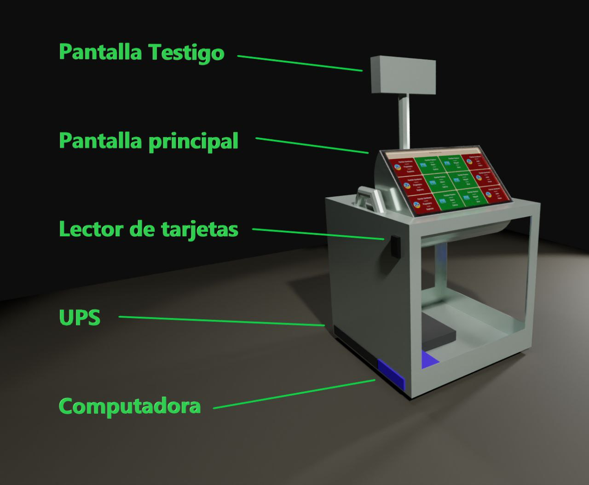
    

    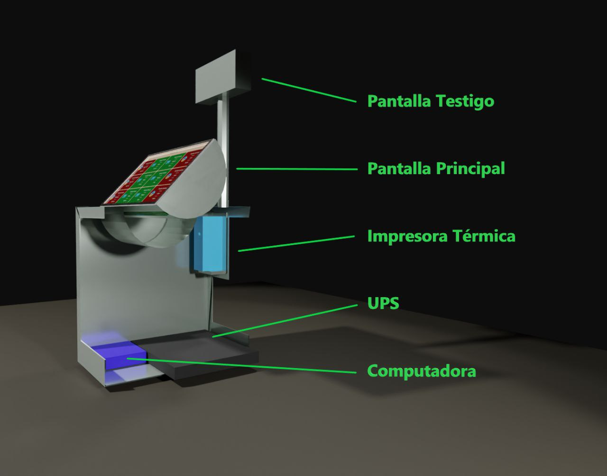
  <figcaption align="center">Componentes internos y externos de la urna.</figcaption>
  </figure>

| Componentes | Descripción | 
| --- | --- | 
|Pantalla Testigo  | Pantalla por el cual el encargado de la elección podrá visualizar el estatus en el que va el ciudadano que está ejerciendo su voto.        |
|Pantalla principal   | Pantalla touch donde el ciudadano realizará el proceso de votación.        |
|Impresora térmica |Dispositivo en el cual se imprimirán los comprobantes de votación. |
|Lector de tarjetas | Dispositivo donde pasaremos la tarjeta que nos dará acceso a la urna.|
|UPS | Donde estarán almacenadas las baterías |
| Computadora | Tal cual su nombre lo indica, estará en ese apartado. |

En la parte superior se encuentra la <b>pantalla principal</b> y la <b>pantalla testigo</b>, las cuales se guardan al final de la jornada de forma manual, con el fin de una mejor transportabilidad sin comprometer estos componentes. También, en esta parte de la urna se encuentran las agarraderas, las cuales nos ayudarán al transporte de este mismo.

En la parte inferior izquierda, se encuentra el lector de tarjetas, así como los puertos (no estoy segura sea la palabra correcta) de la computadora y UPS.

En la parte de adentro se encuentran los componentes UPS, computadora y la impresora térmica, además, en esta parte se irán almacenando los comprobantes de los votos realizados durante la jornada electoral.
Derivado de lo anterior, buscamos componentes que fueran eficaces, accesibles de precio y capaces de resistir toda una jornada electoral sin problema alguno. A continuación, se muestran los componentes elegidos junto con sus especificaciones técnicas.

## Especificaciones técnicas
### **Pantalla Siemens**
<figure>
  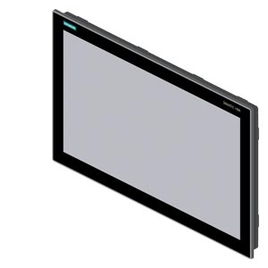
  <figcaption align="center">Pantalla LED.</figcaption>
</figure>

| Información general|  | 
| --- | --- | 
|Designación del productor  | IFP2200 Básica        |
|Designación abreviada   | Pantalla plana básica 22° táctil.        |
|**Display**|
|Diseño de pantalla  | Pantalla panorámica TFT, retroiluminación LED        |
|Diagonal de la pantalla   | 21.5 in,22°        |
|Configuración de visualización en pantalla (OSD)   | No       |
|Número de colores   | 16 000 000 ; 16 millones       |
|**Resolución (Pixeles)**|
|Resolución de imagen | 1,920 x 1,080       |
|Resolución de imagen horizontal   | 1,920 pixeles    |
|Resolución de imagen vertical  | 1,080 pixeles     |
|**Características generales**|
|Desmontable de la unidad de la computadora | 5 m     |
|**Contraluz**|
|Tipo de retroalimentación | LED     |
|Retroiluminación MTBF (a 25 °C) | 30,000 h     |
|Luz de fondo regulable | Sí; 0-100 %     |
|**Elementos de control**|
|Elementos de control | Pantalla multitáctil     |
|**Fuentes de teclado**|
|Teclas de función | No     |
|-Número de teclas de función| 0     |
| Diseño   como pantalla táctil                                          | Sí; Analógico-resistivo        |
| **Tipo de instalación / montaje**                                          |                                |
| Diseño                                                                 | Unidad empotrada               |
| Montaje   frontal                                                      | Sí                             |
| Montaje   VESA                                                         | Sí                             |
| Posibilidad   de montaje en formato vertical                           | Sí                             |
| Posibilidad   de montaje en formato apaisado                           | Sí                             |
| Unidad   incorporada                                                   | Sí                             |
| Máximo   permitido desde el ángulo vertical                            | 45°                            |
| Ángulo   de inclinación hacia atrás máximo permitido desde la vertical | 45°                            |
| **Tensión de alimentación**                                                |                                |
| Tipo de   tensión de alimentación                                      | DC                             |
| Valor   nominal (DC)                                                   | 24 V                           |
| Rango   permisible, límite inferior (DC)                               | 20.4 V                         |
| Rango   permisible, límite inferior (DC)                               | 28.8 V                         |
| **Pérdida de potencia**                                                    |                                |
| Pérdida de   potencia. tipo                                            | 24 W                           |
| Pérdida de   potencia. máxima                                          | 60 W                           |
| **Interfaces**                                                             |                                |
| Número de   interfaces USB                                             | 2; USB 2.0 (con la corriente)  |
| USB on the   rear                                                      | Si                           |
| **Interfaces   de video**                                                  |                                |
| Señal de   video analógica (VGA)                                       | Sí                             |
| Puerto de   visualización                                              | Sí                             |
| **Interfaces   táctiles**                                                  |                                |
| USB                                                                    | Sí                             |
| Grado y clase de protección                                            |                                |
| IP (en la   parte delantera)                                           | IP65                           |
| **Normas, aprobaciones, certificados**                                     |                                |
| CE marca                                                               | Sí                             |
| cULus                                                                  | Sí; UL 61010-1, UL 61010-2-201 |
| Aprobación   KC                                                        | Sí                             |
| FCC                                                                    | Sí                             |
| **Condiciones ambientales**                                                |                                |
| Temperatura ambiente durante el   funcionamiento                       |                                |
| Min.                                                                   | 0 ° C                          |
| Máx.                                                                   | 40 ° C                         |
| Humedad relativa                                                       |                                |
| Operación,   máx.                                                      | 85%                            |
| Vibraciones                                                            |                                |
| Carga de   vibración en funcionamiento                                 | 5 m/s²                         |
| Carga de   vibración durante el transporte / almacenamiento            | 10 m/s²                        |
| Pruebas de choque                                                      |                                |
| Carga de   choque durante el funcionamiento                            | 150 m/s²                       |
| Aceleración   de choque durante el almacenamiento / transporte         | 250 m/s²                       |
| **Mecánica / material**                                                    |                                |
| Material   de la carcasa (frontal)                                     |                                |
| Aluminio                                                               | Sí                             |
| **Dimensiones**                                                            |                                |
| Ancho del   frente de la carcasa                                       | 540 mm                         |
| Altura del   frente de la carcasa                                      | 334 mm                         |
| Recorte de   montaje, ancho                                            | 522 mm                         |
| Recorte de   montaje, altura                                           | 317 mm                         |
| **Pesos**                                                                  |                                |
| Peso sin   embalaje                                                    | 6.5 kg                         |
### **UPS de onda sinusoidal interactiva SmartPro de 120 V, 750 VA, 600 W, 1U para rack/vertical, opciones de tarjeta de administración de red, USB, serie DB9**
Número de modelo: SMART750RM1U

<figure>
  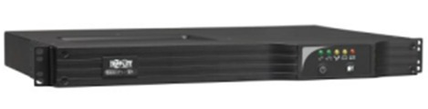
  <figcaption align="center">UPS.</figcaption>
</figure>

Tripp Lite SMART750RM1U 750VA / .75kVA / 600 watts de vatios interactiva. El sistema UPS de onda sinusoidal ofrece protección de energía completa para aplicaciones de red críticas en una configuración vertical/de rack total de 1U altamente eficiente. Las interfaces de administración de red de uso simultáneo incluyen USB, RS-232 y ranura para opciones de tarjeta de administración de red opcionales. La regulación de voltaje interactiva de línea, la supresión de sobretensiones de grado de red y la salida de CA de onda sinusoidal de larga duración durante los apagones hacen que este UPS sea ideal para aplicaciones de redes avanzadas en centros de datos, salas de computadoras y armarios de redes.

|                                                                              |                                                                                                                                                                                                                                                                                                                                                                                                                                                                                                                                                                                                                                                                                                                                                                                                                                                                                                                                                        |
|------------------------------------------------------------------------------|--------------------------------------------------------------------------------------------------------------------------------------------------------------------------------------------------------------------------------------------------------------------------------------------------------------------------------------------------------------------------------------------------------------------------------------------------------------------------------------------------------------------------------------------------------------------------------------------------------------------------------------------------------------------------------------------------------------------------------------------------------------------------------------------------------------------------------------------------------------------------------------------------------------------------------------------------------|
| **Vision general**                                                             |                                                                                                                                                                                                                                                                                                                                                                                                                                                                                                                                                                                                                                                                                                                                                                                                                                                                                                                                                        |
| Código UPC                                                                   | 037332118813                                                                                                                                                                                                                                                                                                                                                                                                                                                                                                                                                                                                                                                                                                                                                                                                                                                                                                                                            |
| Tipo de   UPS                                                                | Interactivo en línea                                                                                                                                                                                                                                                                                                                                                                                                                                                                                                                                                                                                                                                                                                                                                                                                                                                                                                                                   |
|                                                                              |                                                                                                                                                                                                                                                                                                                                                                                                                                                                                                                                                                                                                                                                                                                                                                                                                                                                                                                                                        |
| **Entrada**                                                                      |                                                                                                                                                                                                                                                                                                                                                                                                                                                                                                                                                                                                                                                                                                                                                                                                                                                                                                                                                        |
| Corriente   nominal de entrada (carga máxima)                                | 7A                                                                                                                                                                                                                                                                                                                                                                                                                                                                                                                                                                                                                                                                                                                                                                                                                                                                                                                                                     |
| Voltaje(s)   de entrada nominal admitido(s)                                  | 120V AC                                                                                                                                                                                                                                                                                                                                                                                                                                                                                                                                                                                                                                                                                                                                                                                                                                                                                                                                                |
| Tipo de   conexión de entrada del SAI                                        | 5-15P                                                                                                                                                                                                                                                                                                                                                                                                                                                                                                                                                                                                                                                                                                                                                                                                                                                                                                                                                  |
| Disyuntores   de entrada                                                     | 15A                                                                                                                                                                                                                                                                                                                                                                                                                                                                                                                                                                                                                                                                                                                                                                                                                                                                                                                                                    |
| Servicio   eléctrico recomendado                                             | 15A 120V                                                                                                                                                                                                                                                                                                                                                                                                                                                                                                                                                                                                                                                                                                                                                                                                                                                                                                                                               |
| Fase de   entrada                                                            | Fase única                                                                                                                                                                                                                                                                                                                                                                                                                                                                                                                                                                                                                                                                                                                                                                                                                                                                                                                                             |
| Longitud   del cable de entrada (pies)                                       | 10                                                                                                                                                                                                                                                                                                                                                                                                                                                                                                                                                                                                                                                                                                                                                                                                                                                                                                                                                     |
| Longitud   del cable de entrada                                              | 3.05                                                                                                                                                                                                                                                                                                                                                                                                                                                                                                                                                                                                                                                                                                                                                                                                                                                                                                                                                   |
|                                                                              |                                                                                                                                                                                                                                                                                                                                                                                                                                                                                                                                                                                                                                                                                                                                                                                                                                                                                                                                                        |
| **Salida**                                                                       |                                                                                                                                                                                                                                                                                                                                                                                                                                                                                                                                                                                                                                                                                                                                                                                                                                                                                                                                                        |
| Capacidad   de salida de voltios y amperios (VA)                             | 750                                                                                                                                                                                                                                                                                                                                                                                                                                                                                                                                                                                                                                                                                                                                                                                                                                                                                                                                                    |
| Capacidad   de vatios de salida (Watts)                                      | 600                                                                                                                                                                                                                                                                                                                                                                                                                                                                                                                                                                                                                                                                                                                                                                                                                                                                                                                                                    |
| Factor de   potencia                                                         | 0.8                                                                                                                                                                                                                                                                                                                                                                                                                                                                                                                                                                                                                                                                                                                                                                                                                                                                                                                                                    |
| Detalles   del montaje nominal                                               | 120v, salida nominal en modo   batería                                                                                                                                                                                                                                                                                                                                                                                                                                                                                                                                                                                                                                                                                                                                                                                                                                                                                                                  |
| Compatibilidad   de frecuencia                                               | 60 Hz                                                                                                                                                                                                                                                                                                                                                                                                                                                                                                                                                                                                                                                                                                                                                                                                                                                                                                                                                  |
| Regulación   de voltaje de salida (modo de línea)                            | -21%, +8%                                                                                                                                                                                                                                                                                                                                                                                                                                                                                                                                                                                                                                                                                                                                                                                                                                                                                                                                              |
| Regulación   del voltaje de salida (modo de batería)                         | +/- 5%                                                                                                                                                                                                                                                                                                                                                                                                                                                                                                                                                                                                                                                                                                                                                                                                                                                                                                                                                 |
| Receptáculos   de gestión                                                    | Dos bancos de carga conmutables   de salida única 5-15R                                                                                                                                                                                                                                                                                                                                                                                                                                                                                                                                                                                                                                                                                                                                                                                                                                                                                                |
| Salida de   forma de onda de CA (modo de CA)                                 | Onda sinusoidal                                                                                                                                                                                                                                                                                                                                                                                                                                                                                                                                                                                                                                                                                                                                                                                                                                                                                                                                        |
| Forma de   onda de CA de salida (modo de batería)                            | Onda sinusoidal pura                                                                                                                                                                                                                                                                                                                                                                                                                                                                                                                                                                                                                                                                                                                                                                                                                                                                                                                                   |
| Voltaje(s)   de salida nominal admitido (s)                                  | 110V; 115V; 120V                                                                                                                                                                                                                                                                                                                                                                                                                                                                                                                                                                                                                                                                                                                                                                                                                                                                                                                                       |
| Receptáculos   de salida                                                     | (6) 5-15R                                                                                                                                                                                                                                                                                                                                                                                                                                                                                                                                                                                                                                                                                                                                                                                                                                                                                                                                              |
| Banco de   carga controlables individualmente                                | Sí                                                                                                                                                                                                                                                                                                                                                                                                                                                                                                                                                                                                                                                                                                                                                                                                                                                                                                                                                     |
|                                                                              |                                                                                                                                                                                                                                                                                                                                                                                                                                                                                                                                                                                                                                                                                                                                                                                                                                                                                                                                                        |
| **Batería**                                                                      |                                                                                                                                                                                                                                                                                                                                                                                                                                                                                                                                                                                                                                                                                                                                                                                                                                                                                                                                                        |
| Tipo de   batería                                                            | Ácido de plomo regulado por   válvula (VRLA)                                                                                                                                                                                                                                                                                                                                                                                                                                                                                                                                                                                                                                                                                                                                                                                                                                                                                                           |
| Autonomía   a plena carga (min.)                                             | 4.9 min. (600w)                                                                                                                                                                                                                                                                                                                                                                                                                                                                                                                                                                                                                                                                                                                                                                                                                                                                                                                                        |
| Autonomía   a media carga (min.)                                             | 13.2 min. (300w)                                                                                                                                                                                                                                                                                                                                                                                                                                                                                                                                                                                                                                                                                                                                                                                                                                                                                                                                       |
| Tiempo de   ejecución ampliable                                              | No                                                                                                                                                                                                                                                                                                                                                                                                                                                                                                                                                                                                                                                                                                                                                                                                                                                                                                                                                     |
| Voltaje   del sistema de CC (VDC)                                            | 24                                                                                                                                                                                                                                                                                                                                                                                                                                                                                                                                                                                                                                                                                                                                                                                                                                                                                                                                                     |
| Tasa de   recarga de la batería (baterías incluidas)                         | Menos de 4 horas del 10% al 90%   (típico, descarga a plena carga)                                                                                                                                                                                                                                                                                                                                                                                                                                                                                                                                                                                                                                                                                                                                                                                                                                                                                     |
| Acceso a   la batería                                                        | Puerta de acceso a la batería   del panel frontal                                                                                                                                                                                                                                                                                                                                                                                                                                                                                                                                                                                                                                                                                                                                                                                                                                                                                                      |
| Cartucho   de batería de reemplazo de UPS interno                            |  <a   class="productLink"   href="//www.tripplite.com/1U-UPS-Replacement-24VDC-Battery-Cartridge-1-Set-4-   for-Select-Tripp-Lite-SmartPro-UPS~RBC64-1U">RBC64-1U</a>                                                                                                                                                                                                                                                                                                                                                                                                                                                                                                                                                                                                                                                                                                                                                                                  |
| Descripción   del reemplazo de la batería                                    | Baterías intercambiables en   caliente y reemplazables por el usuario                                                                                                                                                                                                                                                                                                                                                                                                                                                                                                                                                                                                                                                                                                                                                                                                                                                                                  |
|                                                                              |                                                                                                                                                                                                                                                                                                                                                                                                                                                                                                                                                                                                                                                                                                                                                                                                                                                                                                                                                        |
| **Regulación de voltaje**                                                      |                                                                                                                                                                                                                                                                                                                                                                                                                                                                                                                                                                                                                                                                                                                                                                                                                                                                                                                                                        |
| Descripción   de la regulación de voltaje                                    | La regulación automática de   voltaje (AVR) mantiene la operación de alimentación de línea con un rango de   voltaje de entrada de 83 a 147                                                                                                                                                                                                                                                                                                                                                                                                                                                                                                                                                                                                                                                                                                                                                                                                            |
| Corrección   de sobretensión                                                 | Los voltajes de entrada entre   128 y 147 se reducen en un 12%                                                                                                                                                                                                                                                                                                                                                                                                                                                                                                                                                                                                                                                                                                                                                                                                                                                                                         |
| Corrección   de bajo voltaje                                                 | Los voltajes de entrada entre 83   y 107 aumentan en un 14 %                                                                                                                                                                                                                                                                                                                                                                                                                                                                                                                                                                                                                                                                                                                                                                                                                                                                                           |
|                                                                              |                                                                                                                                                                                                                                                                                                                                                                                                                                                                                                                                                                                                                                                                                                                                                                                                                                                                                                                                                        |
| **Interfaz de usuario, alertas y controles**                                   |                                                                                                                                                                                                                                                                                                                                                                                                                                                                                                                                                                                                                                                                                                                                                                                                                                                                                                                                                        |
| Interruptores                                                                | 2 interruptores controlan el   estado de encendido/apagado y la operación de cancelación de alarma/auto   prueba                                                                                                                                                                                                                                                                                                                                                                                                                                                                                                                                                                                                                                                                                                                                                                                                                                       |
| Operación   de cancelación de alarma                                         | La alarma de falla de energía se   puede silenciar usando el interruptor de cancelación de alarma; una vez   silenciada, la alarma volverá a sonar para indicar el estado de batería baja                                                                                                                                                                                                                                                                                                                                                                                                                                                                                                                                                                                                                                                                                                                                                              |
| Alarma   audible                                                             | La alarma audible indica   condiciones de falla de energía, sobrecarga y batería baja                                                                                                                                                                                                                                                                                                                                                                                                                                                                                                                                                                                                                                                                                                                                                                                                                                                                  |
| Indicadores   LED                                                            | 5 LED indican alimentación de   línea, alimentación de batería, sobrecarga, regulación de voltaje y estado de   batería baja/reemplazo                                                                                                                                                                                                                                                                                                                                                                                                                                                                                                                                                                                                                                                                                                                                                                                                                 |
|                                                                              |                                                                                                                                                                                                                                                                                                                                                                                                                                                                                                                                                                                                                                                                                                                                                                                                                                                                                                                                                        |
| **Supresión de sobretensiones / ruido**                                        |                                                                                                                                                                                                                                                                                                                                                                                                                                                                                                                                                                                                                                                                                                                                                                                                                                                                                                                                                        |
| Valor   nominal en julios de supresión de CA del SAI                         | 450                                                                                                                                                                                                                                                                                                                                                                                                                                                                                                                                                                                                                                                                                                                                                                                                                                                                                                                                                    |
| Tiempo de   respuesta de supresión de CA del SAI                             | Instantáneo                                                                                                                                                                                                                                                                                                                                                                                                                                                                                                                                                                                                                                                                                                                                                                                                                                                                                                                                            |
| Supresión   de ruido de CA EMI/RFI                                           | Si                                                                                                                                                                                                                                                                                                                                                                                                                                                                                                                                                                                                                                                                                                                                                                                                                                                                                                                                                    |
|                                                                              |                                                                                                                                                                                                                                                                                                                                                                                                                                                                                                                                                                                                                                                                                                                                                                                                                                                                                                                                                        |
| **Físico**                                                                       |                                                                                                                                                                                                                                                                                                                                                                                                                                                                                                                                                                                                                                                                                                                                                                                                                                                                                                                                                        |
| Factor de   forma principal                                                  | Montaje en rack; Vertical                                                                                                                                                                                                                                                                                                                                                                                                                                                                                                                                                                                                                                                                                                                                                                                                                                                                                                                              |
| Método de   enfriamiento                                                     | Admirador                                                                                                                                                                                                                                                                                                                                                                                                                                                                                                                                                                                                                                                                                                                                                                                                                                                                                                                                              |
| Descripción   del accesorio de montaje incluido                              | Los soportes de montaje   incluidos permiten la instalación en el riel frontal en racks de 2 o 4   postes; Para mayor estabilidad en racks de 4 postes, considere los accesorios   de montaje de 4 postes opcionales 4POSTRAILKIT1U y 4POSTRAILKITWM                                                                                                                                                                                                                                                                                                                                                                                                                                                                                                                                                                                                                                                                                                   |
| Factores   de forma de instalación compatibles con los accesorios incluidos  | Montaje en rack de 2 postes de   19 pulgadas; Montaje frontal de 2 postes; Montaje en rack de 4 postes de 19   pulgadas                                                                                                                                                                                                                                                                                                                                                                                                                                                                                                                                                                                                                                                                                                                                                                                                                                |
| Factores   de forma de instalación admitidos con accesorios opcionales       | 4 post rackmount full-depth   ( <a class="productLink"   href="//www.tripplite.com/4-Post-1U-UniversalAdjustable-Rack-Mount-Shelf-Kit~4POSTRAILKIT1U">4POSTRAILKIT1U</a> );   4 post rackmount shortdepth ( <a class="productLink"   href="//www.tripplite.com/4-Post-1U-Universal-Adjustable-Rack-Mount-ShelfKit-for-Wall-Mount-Racks~4POSTRAILKITWM">4POSTRAILKITWM</a> );   Vertical Mount Enclosures ( <a class="productLink"   href="//www.tripplite.com/SmartRack-5U-Low-Profile-Vertical-Mount-Server-DepthWall-Mount-Rack-Enclosure-Cabinet~SRWF5U36">SRWF5U36</a> ,    <a class="productLink" href="//www.tripplite.com/SmartRack-5U-Low-Profile-Vertical-Mount-Switch-Depth-Wall-Mount-Rack-EnclosureCabinet~SRWF5U">SRWF5U</a> ,    <a class="productLink"   href="//www.tripplite.com/SmartRack-5ULow-Profile-Vertical-Mount-Switch-Depth-Wall-Mount-Structured-Wiring-Enclosure-Adjustable-EquipmentBrackets~SRWF10UMOD">SRWF10UMOD</a> ) |
| Profundidad   mínima requerida del bastidor (cm)                             | 50.16                                                                                                                                                                                                                                                                                                                                                                                                                                                                                                                                                                                                                                                                                                                                                                                                                                                                                                                                                  |
| Profundidad   mínima requerida del bastidor (pulgadas)                       | 19.75                                                                                                                                                                                                                                                                                                                                                                                                                                                                                                                                                                                                                                                                                                                                                                                                                                                                                                                                                  |
| Notas   sobre accesorios de montaje opcionales                               | Optional  <a   class="productLink"   href="//www.tripplite.com/4-Post-1U-Universal-Adjustable-Rack-Mount-ShelfKit-for-Wall-Mount-Racks~4POSTRAILKITWM">4POSTRAILKITWM</a>    enables installation in 4-port shortdepth racks from 14.5 to 23.5 inches (368   to 597mm); Optional  <a class="productLink"   href="//www.tripplite.com/4-Post-1U-Universal-Adjustable-Rack-Mount-ShelfKit~4POSTRAILKIT1U">4POSTRAILKIT1U</a>    enables installation in 4-post full-depth racks from 20.5 to 36 inches (521   to 914mm)                                                                                                                                                                                                                                                                                                                                                                                                                                  |
| Profundidad   primaria del SAI (mm)                                          | 425                                                                                                                                                                                                                                                                                                                                                                                                                                                                                                                                                                                                                                                                                                                                                                                                                                                                                                                                                    |
| Altura del   SAI primario (mm)                                               | 44                                                                                                                                                                                                                                                                                                                                                                                                                                                                                                                                                                                                                                                                                                                                                                                                                                                                                                                                                     |
| Ancho del   SAI primario (mm)                                                | 445                                                                                                                                                                                                                                                                                                                                                                                                                                                                                                                                                                                                                                                                                                                                                                                                                                                                                                                                                    |
| Altura del   estante                                                         | 1U                                                                                                                                                                                                                                                                                                                                                                                                                                                                                                                                                                                                                                                                                                                                                                                                                                                                                                                                                     |
| Dimensiones   de envío (alto ancho / cm)                                     | 13.21 x 58.67 x 52.58                                                                                                                                                                                                                                                                                                                                                                                                                                                                                                                                                                                                                                                                                                                                                                                                                                                                                                                                  |
| Dimensiones   de envío (alt x prof. /pulg.)                                  | 5.20 x 23.10 x 20.70                                                                                                                                                                                                                                                                                                                                                                                                                                                                                                                                                                                                                                                                                                                                                                                                                                                                                                                                   |
| Peso de   envío (kg)                                                         | 15.47                                                                                                                                                                                                                                                                                                                                                                                                                                                                                                                                                                                                                                                                                                                                                                                                                                                                                                                                                  |
| Peso de   envío (libras)                                                     | 34.1                                                                                                                                                                                                                                                                                                                                                                                                                                                                                                                                                                                                                                                                                                                                                                                                                                                                                                                                                   |
| Material   de la carcasa del SAI                                             | Acero                                                                                                                                                                                                                                                                                                                                                                                                                                                                                                                                                                                                                                                                                                                                                                                                                                                                                                                                                  |
| Dimensiones   del módulo de alimentación del SAI (alt. x prof., cm)          | 4.44 x 44.45 x 42.54                                                                                                                                                                                                                                                                                                                                                                                                                                                                                                                                                                                                                                                                                                                                                                                                                                                                                                                                   |
| Dimensiones   del módulo de alimentación del SAI (al x x prof., pulg.)       | 1.75 x 17.5 x 16.75                                                                                                                                                                                                                                                                                                                                                                                                                                                                                                                                                                                                                                                                                                                                                                                                                                                                                                                                    |
| Peso del   módulo de potencia del SAI (kg)                                   | 13.61                                                                                                                                                                                                                                                                                                                                                                                                                                                                                                                                                                                                                                                                                                                                                                                                                                                                                                                                                  |
| Peso del   módulo de alimentación del SAI (lb)                               | 30                                                                                                                                                                                                                                                                                                                                                                                                                                                                                                                                                                                                                                                                                                                                                                                                                                                                                                                                                     |
|                                                                              |                                                                                                                                                                                                                                                                                                                                                                                                                                                                                                                                                                                                                                                                                                                                                                                                                                                                                                                                                        |
| **Ambiental**                                                                    |                                                                                                                                                                                                                                                                                                                                                                                                                                                                                                                                                                                                                                                                                                                                                                                                                                                                                                                                                        |
| Rango de   temperatura de funcionamiento                                     | +32 a +104 grados Fahrenheit / 0   a +40 grados Celsius                                                                                                                                                                                                                                                                                                                                                                                                                                                                                                                                                                                                                                                                                                                                                                                                                                                                                                |
| Rango de   temperatura de almacenamiento                                     | +5 a +122 grados Fahrenheit /   -15 a +50 grados Celsius                                                                                                                                                                                                                                                                                                                                                                                                                                                                                                                                                                                                                                                                                                                                                                                                                                                                                               |
| Humedad   relativa                                                           | 0 a 95%, sin condensación                                                                                                                                                                                                                                                                                                                                                                                                                                                                                                                                                                                                                                                                                                                                                                                                                                                                                                                              |
| Modo AC   BTU / Hr. (Carga completa)                                         | 38                                                                                                                                                                                                                                                                                                                                                                                                                                                                                                                                                                                                                                                                                                                                                                                                                                                                                                                                                     |
| Modo de   batería BTU / Hr. (Carga completa)                                 | 545                                                                                                                                                                                                                                                                                                                                                                                                                                                                                                                                                                                                                                                                                                                                                                                                                                                                                                                                                    |
| Clasificación   de eficiencia del modo CA (100 % de carga)                   | 98%                                                                                                                                                                                                                                                                                                                                                                                                                                                                                                                                                                                                                                                                                                                                                                                                                                                                                                                                                    |
| Ruido   audible                                                              | 45 dBA máximo, lado frontal 1 m                                                                                                                                                                                                                                                                                                                                                                                                                                                                                                                                                                                                                                                                                                                                                                                                                                                                                                                        |
|                                                                              |                                                                                                                                                                                                                                                                                                                                                                                                                                                                                                                                                                                                                                                                                                                                                                                                                                                                                                                                                        |
| **Comunicaciones**                                                               |                                                                                                                                                                                                                                                                                                                                                                                                                                                                                                                                                                                                                                                                                                                                                                                                                                                                                                                                                        |
| Tarjetas   de administración de red                                          | SNMPWEBCARD;  <a   class="productLink"   href="//www.tripplite.com/Web-Management-Accessory-CardSmartPro-SmartOnline-UPS-Systems~TLNETCARD">TLNETCARD</a>     <a class="productLink" href="//www.tripplite.com/Web-Management-Accessory-Card~WEBCARDLX">WEBCARDLX</a>                                                                                                                                                                                                                                                                                                                                                                                                                                                                                                                                                                                                                                                                                  |
| Descripción   del puerto de monitoreo de red                                 | Admite el monitoreo detallado de   las condiciones de energía del sitio y del UPS                                                                                                                                                                                                                                                                                                                                                                                                                                                                                                                                                                                                                                                                                                                                                                                                                                                                      |
| Software   PowerAlert                                                        | Para monitoreo local a través de   los puertos de comunicación integrados del UPS, descargue el software   PowerAlert Local en https://www.tripplite.com/poweralert                                                                                                                                                                                                                                                                                                                                                                                                                                                                                                                                                                                                                                                                                                                                                                                    |
| Cable de   comunicaciones                                                    | Cableado USB y DB9 incluido                                                                                                                                                                                                                                                                                                                                                                                                                                                                                                                                                                                                                                                                                                                                                                                                                                                                                                                            |
| Compatibilidad   con WatchDog                                                | Admite la aplicación Watchdog,   el sistema operativo y las opciones de reinicio de reinicio completo para   aplicaciones remotas                                                                                                                                                                                                                                                                                                                                                                                                                                                                                                                                                                                                                                                                                                                                                                                                                      |
| Descripción   de la tarjeta de administración de red                         | Tarjeta de administración de red   opcional                                                                                                                                                                                                                                                                                                                                                                                                                                                                                                                                                                                                                                                                                                                                                                                                                                                                                                            |
| Interfaz   de comunicaciones                                                 | Serie DB9; EPO (apagado de   emergencia); Ranura para interfaz SNMP/Web; USB                                                                                                                                                                                                                                                                                                                                                                                                                                                                                                                                                                                                                                                                                                                                                                                                                                                                           |
|                                                                              |                                                                                                                                                                                                                                                                                                                                                                                                                                                                                                                                                                                                                                                                                                                                                                                                                                                                                                                                                        |
| **Transferencia de línea / Batería**                                           |                                                                                                                                                                                                                                                                                                                                                                                                                                                                                                                                                                                                                                                                                                                                                                                                                                                                                                                                                        |
| Tiempo de   transferencia                                                    | 5 milisegundos CA a CC; 1   milisegundo de CC a CA                                                                                                                                                                                                                                                                                                                                                                                                                                                                                                                                                                                                                                                                                                                                                                                                                                                                                                     |
| Transferencia   de bajo voltaje a energía de batería (punto de ajuste)       | 83                                                                                                                                                                                                                                                                                                                                                                                                                                                                                                                                                                                                                                                                                                                                                                                                                                                                                                                                                     |
| Transferencia   de alto voltaje a la energía de la batería (punto de ajuste) | 147                                                                                                                                                                                                                                                                                                                                                                                                                                                                                                                                                                                                                                                                                                                                                                                                                                                                                                                                                    |
|                                                                              |                                                                                                                                                                                                                                                                                                                                                                                                                                                                                                                                                                                                                                                                                                                                                                                                                                                                                                                                                        |
| **Características y especificaciones**                                         |                                                                                                                                                                                                                                                                                                                                                                                                                                                                                                                                                                                                                                                                                                                                                                                                                                                                                                                                                        |
| Orejeta de   puesta a tierra                                                 | Terminal de conexión a tierra   del panel posterior                                                                                                                                                                                                                                                                                                                                                                                                                                                                                                                                                                                                                                                                                                                                                                                                                                                                                                    |
| Arranque   en frío (arranque en modo batería durante un corte de energía)    | Operación de arranque en frío   compatible                                                                                                                                                                                                                                                                                                                                                                                                                                                                                                                                                                                                                                                                                                                                                                                                                                                                                                             |
| Funciones   de UPS de alta disponibilidad                                    | Supervisión y reinicio   automáticos de la sonda (requiere WEBCARDLX); Regulación Automática de   Voltaje (AVR); Baterías intercambiables en caliente; Gestión remota; Salida   de onda sinusoidal; Protección contra sobretensiones/ruido                                                                                                                                                                                                                                                                                                                                                                                                                                                                                                                                                                                                                                                                                                             |
|                                                                              |                                                                                                                                                                                                                                                                                                                                                                                                                                                                                                                                                                                                                                                                                                                                                                                                                                                                                                                                                        |
| **Estándares y cumplimientos**                                                  |                                                                                                                                                                                                                                                                                                                                                                                                                                                                                                                                                                                                                                                                                                                                                                                                                                                                                                                                                        |
| Certificaciones del producto                                                     | CSA (Canadá); NOM (México); UL   1778                                                                                                                                                                                                                                                                                                                                                                                                                                                                                                                                                                                                                                                                                                                                                                                                                                                                                                                  |
| Cumplimiento del producto                                                        | RoHS; FCC Parte 15 Clase A (EE.   UU.)                                                                                                                                                                                                                                                                                                                                                                                                                                                                                                                                                                                                                                                                                                                                                                                                                                                                                                                 |
|                                                                              |                                                                                                                                                                                                                                                                                                                                                                                                                                                                                                                                                                                                                                                                                                                                                                                                                                                                                                                                                        |
| **Garantía**                                                                     |                                                                                                                                                                                                                                                                                                                                                                                                                                                                                                                                                                                                                                                                                                                                                                                                                                                                                                                                                        |
| Período de   garantía del producto (en todo el mundo)                        | 2 años de garantía, 3 años con registro. Nota:  <a class="insuranceLink"   href="//www.tripplite.com/support/product-warranty-registration">El registro es necesario</a>  para garantía de 3 años.                                                                                                                                                                                                                                                                                                                                                                                                                                                                                                                                                                                                                                                                                                                                                   |
| Seguro de   equipo conectado (EE. UU., Canadá y Puerto Rico)                 | $250,000 <a   class="insuranceLink"   href="//www.tripplite.com/support/insurance-policy">Ultimate   Lifetime Insurance</a>                                                                                                                                                                                                                                                                                                                                                                                                                                                                                                                                                                                                                                                                                                                                                                                                                            |    

### **TPTCM60III**
Impresora de comprobantes/billetes 60mm
<figure>
  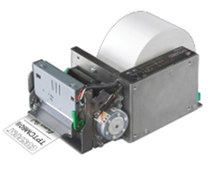
  <figcaption align="center">Impresora térmica.</figcaption>
</figure>

<b>Características</b>:

•	Mejor calidad de impresión a 200dpi

•	Ancho del papel 60mm

•	Espesor del papel: de 63 a 100 μm

•	Velocidad > de 140mm/seg

•	Diámetro del rollo del papel hasta 160mm (con kit de fijación de la brida opcional)

•	Interfaces RS232 y USB

•	Cortadora altamente fiable: > de 1.000.000 de cortes

•	Sensores: temperatura del cabeza, presencia del papel, apertura del cabezal de impresión, final del papel y casi final del papel. (Opcional: casi final del papel sobre soporte del rollo)

•	Capacidad de impresión de códigos de barras 1D/2D (QRCODE)

•	Fuentes internacionales a bordo: cualquier idioma disponible

•	Disponible potente dispensador motorizado

•	Robusta y fiable: partes mecánicas resistentes y ligeras

•	Versátil: soporte rollo de papel opcional en 5 posiciones

•	Salida iluminada del papel (LED)

•	Conector de alimentación DIN

•	Disponible versión Cut&drop

•	Boquilla de papel de plástico (opcional)

<figure>
  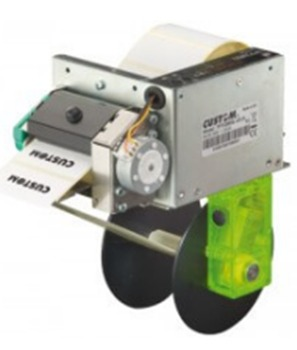
  <figcaption align="center">Vista trasera.</figcaption>
</figure>

<b>Aplicaciones</b>

•	Kioskos self-service

•	Ventanillas bancarias y cajeros automáticos

•	Distribuidores automáticos: leche, agua, vino, detergentes líquidos

•	Máquinas industriales

•	Sistema de eliminación de códigos

•	Sistemas de aparcamiento

•	Control de calidad

| FICHA TÉCNICA                     |                                                                                                             |
|-----------------------------------|-------------------------------------------------------------------------------------------------------------|
| Método de   impresión             | Térmica con cabezal fijo                                                                                    |
| Número de   dot                   | 8 dots/mm                                                                                                   |
| Resolución                        | 203 dpi                                                                                                     |
| Velocidad   de impresión (mm/seg) | >140 mm/seg                                                                                                 |
| Set   caracteres                  | Internacionales (por defecto),   chino, coreano                                                             |
| Códigos   de barras soportados    | UPCA, UPCE, EAN13, EAN8, CODE39,   ITF, CODABAR, CODE93, CODE128, CODE32, PDF417, DATAMATRIX, AZTEC, QRCODE |
| Formato   de impresión            | Altura y ancho de 1 a 8, negrita,   negativo, subrayado, cursiva                                            |
| Dirección   de impresión          | Derecho, 90°, 180°, 270°                                                                                    |
| Ancho del   papel:                | 60 mm                                                                                                       |
| Gramaje   del papel               | de 60 a 90 g/m²                                                                                             |
| Espesor   del papel               | de 63 a 100 μm                                                                                              |
| Dimensiones   del rollo           | 160 mm (90 mm sin brida porta   rollo)                                                                      |
| Emulación                         | CUSTOM/POS, TPTCMII                                                                                         |
| Interfaces                        | RS232 + USB                                                                                                 |
| Buffer   datos                    | 16 kb                                                                                                       |
| Memoria   flash                   | 1MB interna, 4MB externa                                                                                    |
| Memoria   RAM                     | 128Kb interna, 8MB externa                                                                                  |
| Driver                            | Windows® (32/64 bit) – solo bajo   pedido WHQL e instalación silenciosa;                                    |
|                                   | Linux   (32/64 bits);                                                                                       |
|                                   | COM   virtual (Linux o Windows 32/64 bit);                                                                  |
|                                   | Android™                                                                                                    |
| Tool software                     | PrinterSet, CustomPowerTool,   Status Monitor, Custom Windows API                                           |
| Alimentación                      | 24 Vdc ± 10%                                                                                                |
| Absorción   medio                 | 1.2A (12.5% dots encendidos)                                                                                |
| MTBF                              | 122.000 horas (Tarjeta   electrónica)                                                                       |
| Vida   cabezal                    | 50 km / 100M impulsos                                                                                       |
| MCBF                              | 1.000.000 de cortes                                                                                         |
| Temperatura   de funcionamiento   | 0°C + 50°C                                                                                                  |
| Dimensiones                       | 194,5(L)x80,3(H)x112,4(W) mm con   boca de papel corta                                                      |
|                                   | 265,5(L)x80,3(H)x115(W)   mm con dispenser                                                                  |
| Peso                              | 1,2 Kg (sin expulsor)                                                                                       |
|                                   | 1,5 Kg   (con expulsor)                                                                                     |

## **HID 6005BGB00 Proximity ProxPoint Plus Reader, interfaz Wiegand, cable flexible de 18", gris**

<figure>
  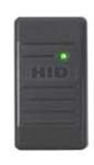
  <figcaption align="center">Vista trasera.</figcaption>
</figure>

También conocido como: HU-6005BGB00, HID-6005BGB00
El HID 6005BGB00 es un mini lector de proximidad de parteluz de 125 kHz con una carcasa gris carbón. Siendo uno de los lectores más pequeños de la serie ProxPoint exclusiva de HID, el 6005BGB00 es perfecto para un control de acceso discreto y conveniente.

El lector está equipado con un bíper controlado localmente o por el host y un sistema de notificación LED que se puede configurar para adaptarse a las necesidades específicas de su instalación con una funcionalidad estándar 00 común. El diseño elegante y compacto del lector permite una instalación discreta en interiores, exteriores e incluso en metal, sin comprometer el rango de lectura.
El 6005BGB00 puede leer tarjetas con formatos de hasta 85 bits y es compatible con casi cualquier sistema de control de acceso. Coleta de alambre estándar de 18" también incluida.

| Dimensiones                   | 3,14" x 1,72" x   0,66" (7,76 x 4,37 x 1,68 cm)             |
|-------------------------------|-------------------------------------------------------------|
| Suministro de energía         | 5-16 VDC, se recomienda suministro lineal                   |
| Requisitos de energía         | Corriente (CC) promedio de 30   mA, pico de 75 mA           |
| Temperatura de funcionamiento | -22F a 150F (-30C a 65C)                                    |
| Humedad de funcionamiento     | 0 a 95 por ciento de humedad   relativa, sin condensación   |
| Frecuencia de transmisión     | 125kHz                                                      |
| Ambiental                     | IP55                                                        |
| Distancia del cable           | Wiegand/interfaz de reloj y   datos 500 pies (150 m) 22 AWG |
| Material de la carcasa        | policarbonato UL 94                                         |
| Garantía de por vida          |                                                             |

## Software

El software es el encargado de proveer la interacción de las personas con la urna, y controlar la información mostrada, ingresada y almacenada durante el proceso de votación.

Un correcto diseño de software permitirá que el sistema pueda escalar (incremento de urnas, usuarios, elecciones, etc.) sin perder eficiencia ni requerir un constante mantenimiento. Además, debe ser flexible y tolerante a cambios, es decir, si se requiere integrar alguna nueva funcionalidad, el diseño del software debe ser capaz de aceptarla con poca o nula intervención en las funcionalidades existentes dentro de esté.

Los siguientes apartados detallan la selección del lenguaje de programación propuesto, así como los frameworks y motor de base de datos, a utilizar para el desarrollo del software. También se presenta el modelo cliente-servidor que será a partir del cual se partirá para el diseño de interacción entre las urnas. Finalmente se presenta y describe el diagrama relacional, donde se muestra la información que será almacenada dentro del sistema.

### **Lenguajes de programación**

El lenguaje de programación permite dar instrucciones a la computadora, que permiten desarrollar software. Cada lenguaje de programación tiene diferentes características y han sido pensado para solucionar diferentes tipos de problemas, cada uno cuenta con ventajas y desventajas, por lo cual, hay que elegir aquel que se adapte mejor a las necesidades de la urna electrónica. 

A continuación, se describen diferentes lenguajes de programación:

- **Java**: Es un lenguaje de programación ampliamente utilizado para codificar aplicaciones web. Java es un lenguaje multiplataforma, orientado a objetos y centrado en la red que se puede utilizar como una plataforma en sí mismo. Es un lenguaje de programación rápido, seguro y fiable para codificar todo, desde aplicaciones móviles y software empresarial hasta aplicaciones de macrodatos y tecnologías del lado del servidor.

- **PHP**: Es un lenguaje de programación que permite el desarrollo web o aplicaciones web dinámicas, el cual es apto para incrustar el lenguaje HTML, ahora bien, siempre siguiendo algunas reglas establecidas. 
Además, el lenguaje PHP favorece a la conexión entre el servidor y a la interfaz del usuario.

- **Python**: Es un lenguaje de programación de propósito general comúnmente utilizado para el desarrollo de aplicaciones web, investigación científica, aprendizaje automático y FinTech. Además, su código repetible y sus capacidades de automatización promueven procesos de construcción simplificados.

- **C#**: Es un lenguaje de programación orientado a objetos orientado a componentes. C# proporciona construcciones de lenguaje para admitir directamente estos conceptos, por lo que se trata de un lenguaje natural en el que se crea y usa componentes de software.
C# permite a los desarrolladores crear muchos tipos de aplicaciones seguras y sólidas que se ejecutan en .NET.

|                 | **Java**                                        | **PHP**                                                 | **Python**                                   | **C#**                                                       |
| --------------- | :---------------------------------------------- | :------------------------------------------------------ | :------------------------------------------- | ------------------------------------------------------------ |
| **Ventajas**    | Curva de aprendizaje alta                       | Lenguaje libre                                          | Baja curva de aprendizaje                    | Un Lenguaje Seguro                                           |
|                 | Está orientado a los objetos                    | Dispone de una sintaxis muy limpia                      | Polivalente y de paradigmas                  | Orientado a Objetos                                          |
|                 | Es multiplataforma                              | Se integra de una manera muy simple en la base de datos | Amplia colección de bibliotecas y frameworks | Más Sencillo que C++                                         |
|                 | Cuenta con liberación de memoria                |                                                         | Portabilidad                                 | Seguro pero flexible                                         |
|                 |                                                 |                                                         | Gratis y de código abierto                   | Mejor manejo de memoria                                      |
| **Desventajas** | Es de lenguaje Interpretado                     | Brechas de seguridad que puede haber en el servidor     | Lentitud                                     | Se debe conseguir una versión reciente de Visual Studio .NET |
|                 | Requiere de experiencia en programación         | El código fuente no se puede ocultar con facilidad      | Consumo de memoria                           | Alta curva de aprendizaje                                    |
|                 | Es de sintaxis compleja                         | Para su ejecución, es necesario un servidor             | Desarrollo móvil                             | Requisitos de computo altos                                  |
|                 | Se ejecuta solo en dispositivos y equipos aptos |                                                         |                                              |                                                              |

Para el proyecto de la urna electrónica se propone utilizar python como lenguaje base. En los últimos años python ha evolucionado para ser uno de los lenguajes preferidos en la industria de desarrollo de software e investigación en inteligencia artificial. Por lo cual, se han desarrollado múltiples frameworks que permiten trabajar desde aplicaciones de escritorio hasta aplicaciones web para el backend de estas. Dentro de los frameworks explorados encontramos:

> - **[Flask](https://flask.palletsprojects.com/)**: es un framework minimalista para el desarrollo de aplicaciones web de manera rápida y con muy pocas líneas de código.
> - **[Django](https://www.djangoproject.com/)**: es un framework web de alto nivel que fomenta un desarrollo rápido y un diseño limpio y pragmático. Este es más avanzado que flask.
> - **[Kivy](https://kivy.org/)**: es un framework Python gratuito y de código abierto para desarrollar aplicaciones móviles y otro software de aplicación multitáctil con una interfaz de usuario natural. Se distribuye bajo los términos de la licencia MIT y puede ejecutarse en Android, iOS, Linux, macOS y Windows.
> - **[Tkinter](https://docs.python.org/es/3/library/tkinter.html)**: es una librería de Python y funciona para la creación y desarrollo de interfaces 
gráficas de usuario, es rápido y fácil de programar, aunque su documentación estándar es débil

Para el servidor web se eligío utilizar DJANGO, mientras que para la aplicación que vivirá en la urna será desarrollada con KIVY para la interfaz gráfica.

### **¿Por qué Kivy?**
- Es exportable a dispositivos móviles.
- Multiplataforma, es decir, funciona en varios sistemas operativos o dispositivos ya que
 puede ejecutarse en iOS, Android, Windows, OS X y GNU / Linux
- Widgets fáciles de usar construidos con soporte multitáctil.
- Funciona mejor que las alternativas multiplataforma de HTML5.
- Orientada a generar prototipos de manera rápida y con diseños eficientes que favorecen
 códigos re-utilizables y de fácil despliegue.
- Permite crear urnas portátiles en dispositivos móviles como tabletas electrónicas.

### **Manejador de base de datos**

Un sistema manejador de base de datos es un software utilizado para gestionar, almacenar y recuperar bases de datos, también optimiza la organización de los datos mediante una técnica de esquema llamada normalización, estos funcionan mediante comandos de sistema, cuentan con un administrador que recibe los comandos y da las instrucciones para recuperar, guardar o modificar los datos.

Para el trabajo en la parte de software en el manejo de bases de datos nuestras opciones fueron MySQL, MariaDB, PostgreSQL y SQLite.

> - **MYSQL**: Es el manejador de bases de datos más usado, fue diseñado para bases de datos grandes, se basa en SQL y en la arquitectura cliente-servidor. Es el sistema de gestión de datos más utilizado por su compatibilidad con varias plataformas informáticas como Linux, Windows y macOS, también es compatible con lenguajes de programación como C, C++, Java, Perl, PHP, Python y Ruby. MySQL  es de código abierto, lo que implica que puede ser modificado bajo los términos de la licencia pero si es necesario la versión con licencia para usarlo en aplicaciones comerciales.
> - **MARIADB**: Es un manejador de datos que tiene parecido con MySQL, ya que fue desarrollado por uno de sus desarrolladores, este también es un software libre lo que más destaca de este software es que puede remplazar a los programas que funcionan con MySQL.
> - **POSTGRESQL**: Es un sistema de bases relacionales libre y de código abierto aparte de que ofrece una gran cantidad de opciones avanzadas, por lo que es considerado el mejor manejador de bases de datos en la actualidad.
> - **SQLite**: Es un software libre que permite almacenar información en dispositivos de manera sencilla, eficaz, potente y rápida en equipos de pocas capacidades de hardware, como lo puede ser un teléfono. SQLite implementa el estándar sql92 y también agrega extensiones que facilitan el uso de cualquier ambiente de desarrollo, lo que permite que pueda soportar consultas básicas hasta otras más complejas, también lo más importante es que puede ser usado tanto en dispositivos móviles como en dispositivos de escritorio, todo gracias a que cuenta con compatibilidad.

Para el proyecto de la urna electrónica se propone usar PostgreSQL y SQLite el primero es una muy buena opción ya que PostgreSQL es un software que trabaja mejor con bases de datos grandes y como la urna está planeada con el objetivo de registrar todos los votos de la población será una muy buena opción para manejar los datos de votos, también se propone el uso de SQLite por ser un programa muy ligero que puede funcionar en cualquier tipo de equipos con poca capacidad de hardware por lo que se pueden crear urnas digitales en dispositivos más pequeños como móviles o tabletas electrónicas. 

### **Arquitecura Cliente-Servidor**

La arquitectura cliente-servidor es un modelado de sistemas, donde las tareas se reparten entre proveedores de recursos o servicios, llamados servidores y los consumidores llamados clientes.

Para la urna electrónica se propone utilizar esta arquitectura, donde habrá un servidor que proveerá de la configuración inicial a las urnas electrónicas, y las urnas electrónicas que mantendrán una copia de la información requerida para su funcionamiento, la cual obtendrán del servidor central, a quien también le comunicarán los resultados finales, ya sea a través de internet o de una red local privada. El siguiente diagrama muestra la arquitectura y la comunicación de cada una de las partes. 
 

<figure>
  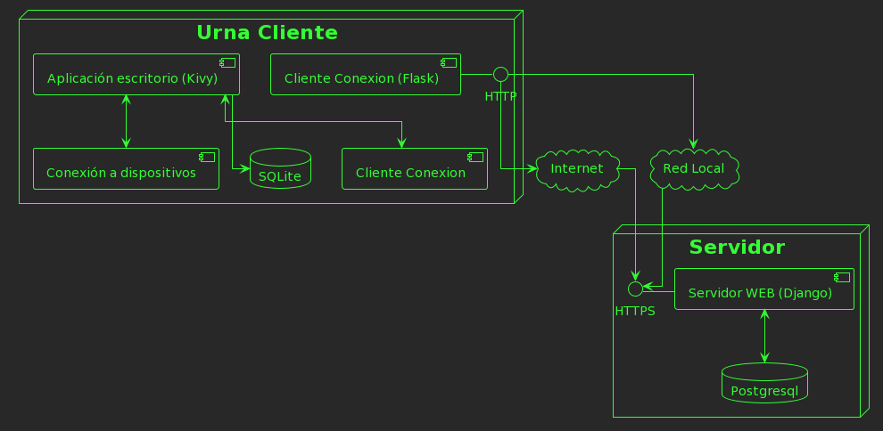
  <figcaption align="center">Diagrama componentes de cliente-servidor, se puede observar que el cliente utilizará SQLite para el almacenamiento de datos, mientras que el servidor Postgres, para gestionar múltiples urnas.</figcaption>
</figure>

### **Diseño de datos**

El sistema de la urna electrónica requiere almacenar información para su correcto funcionamiento, en el siguiente diagrama se muestra el diseño de la estructura de los datos y su relación entre ellos. Entre las entidades más relevantes podemos ver, los datos generales de las Casillas, los funcionarios y la boleta, donde se almacenará el conteo de los votos, se modela el candidato y su relación con múltiples partidos.

<figure>
  
    <figcaption align="center">Diagrama relacional para mantener la información necesaria para el funcionamiento de la urna electrónica </figcaption>
</figure>

A continuación se describe cada una de las entidades y sus atributos:

> **Urna**: Esta entidad será la encargada en el servidor de almacenar todas las urnas registradas y autorizadas a recibir o enviar información. Mientras que, en la urna, almacenará su información para solicitar los accesos pertinentes.
>  - id_urna: number \<<auto-generado\>>: Identificador numérico de la urna, único para cada urna.
>  - public_key: text \<<encriptado\>>: Llave pública, para poder encriptar y desencriptar los mensajes, también se puede usar para verificar la identidad de la urna.
>  ---
>  - mac_address: text: Dirección MAC del dispositivo de red único en el mundo para el dispositivo colocado, usado para la autenticación junto con la llave publica y el uudi de la tarjeta madre.
>  - uuid_motherboard: uuid: Identificador único de la tarjeta madre utilizada en la urna, es asignado por el fabricante y también se usa para identificar la urna.
>  - registered_at: datetime: Fecha en que la urna se registra en el sistema principal.
>  - updated_at: datetime: Fecha de última actualización de la urna. Puede ser cuando se configuró o cuando se reinició.

> **Casilla**: Almacenará la información de la casilla a la que fue asignada la urna.
>    * id_casilla : number \<<auto-generado\>>: Identificador numérico único de registro de la casilla.
>    ---
>    * entidad : text: Entidad federativa donde se instalará la casilla.
>    * municipio : text: Municipio donde se instalará la casilla.
>    * localidad : text: Localidad donde se instalará la casilla.
>    * distrito : text: Distrito al que pertenece la casilla.
>    * seccion_electoral : text: Sección de la casilla.
>    * tipo_casilla: text: Tipo de casilla.

> **Usuario**: Entidad encargada de almacenar la información de los usuarios que pueden acceder a algún tipo de configuración de la urna.
>    * id_usuario : number \<<auto-generado\>>: Identificador numérico único del usuario.
>    * id_funcionario : number \<<llave-foranea\>>: Los funcionarios son aquellos primeros usuarios que serán registrados (tienen una entidad para sus datos propia)
>    ---
>    * identificador_tarjeta : text: Identificador de tarjeta para su acceso.
>    * contraseña: text \<<encriptado\>>: Contraseña para el ingreso en caso de que la tarjeta no funcione, esta se encontrará encriptada.

> **Permiso**: Almacena el nivel de acceso de los usuarios, ya que no todos los usuarios tienen permiso de realizar todas las actividades.
>    * id_permiso : number \<<auto-generado\>>: Identificador numérico único de los permisos.
>    ---
>    * nombre : text: Nombre del permiso. (ej. SuperUsuario)
>    * descripción : text: Descripción larga del permiso registrado.

> **Funcionario**: Datos de los funcionarios de casilla.
>    * id_funcionario : number <<auto-generado>>: Identificador numérico único.
>    * id_tipo_funcionario: number <<llave-foranea>>: Tipo de funcionario, categoría o cargo.
>    ---
>    * clave_elector : text: Clave de elector del funcionario, debe ser un ciudadano.
>    * foto_funcionario: text: Foto para identificar al funcionario físicamente.
>    * nombre : text: Nombre o nombres del funcionario.
>    * apellido_paterno : text: Apellido paterno del funcionario.
>    * apellido_materno : text: Apellido materno del funcionario.
>    * curp : text: Clave única de registro de población del funcionario.
>    * fecha_nacimiento : date: Fecha de nacimiento del funcionario.
>    * sexo : text: Sexo del funcionario.
>    * entidad : text: Entidad federativa donde vive el funcionario.
>    * municipio : text: Municipio donde vive el funcionario.
>    * localidad : text: Localidad donde vive el funcionario.
>    * dirección : text: Dirección donde vive el funcionario.
>    * calle : text: Calle donde vive el funcionario.
>    * número : text: Número de casa donde vive el funcionario.

> **Tipos funcionario**: Catálogo de la información de los diferentes tipos de funcionario.
>    * id_tipo_funcionario : number \<<auto-generado\>>: Identificador numérico único.
>    ---
>    * nombre : text: Nombre del cargo/tipo/categoría del funcionario.
>    * descripción : text: Descripción larga del tipo de funcionario.

> **Elección**: 
>    * id_elección : number <<auto-generado>>: Identificador numérico único.
>    * id_tipo_elección : number <<llave-foranea>>: Identificador del tipo de elección que se está ejecutando.
>   ---
>    * nombre : text: Nombre de la elección.
>    * tipo : text: Tipo de elección.
>    * fecha : date: Fecha en la que se debe llevar a cabo la elección.

> **Tipos elección**: Catalogo de tipos de elección.
>    * id_tipo_elección : number <<auto-generado>>: Identificador numérico único.
>    ---
>    * nombre : text: Nombre del tipo de elección.
>    * descripciónn : text: Descripción larga del tipo de elección.

> **Boleta**: Lleva el conteo de los votos y la estructura de las boletas que se mostrarán en pantalla.
>    * id_boleta: number <<auto-generado>>: Identificador numérico único.
>    * id_elección : number <<llave-foránea>>: Identificador de la elección a la que pertenece la boleta.
>    ---
>    * cantidad_máxima : number: Cantidad máxima de boletas que deben mostrarse ( en caso de que exista un limite, 0 para sin límite)
>    * votos_ejercidos : number: Contador de votos ejercidos sobre esta configuración de boleta.
>    * entidad : text: Entidad para la que está configurada la boleta.
>    * municipio : text: Municipio para la que está configurada la boleta.
>    * localidad : text: Localidad para la que está configurada la boleta.
>    * distrito : text: Distrito para la que está configurada la boleta.
>    * seccion_electoral : text: Sección para la que está configurada la boleta.
>    * tipo_casilla: text: Tipo de casilla a la que pertenece la boleta.

> **Voto**: Registro del voto, no se registra quien vota.
>    * id_voto : number <<auto-generado>>: Identificador númerico único.
>    * candidato : number <<llave-foranea>>: Identificador del candidato que seleccionó el votante.
>    ---
>    * folio: number: Número consecutivo generado para mantener el orden de los votos.
>    * fecha_hora_inicio_votación: datetime: Tiempo de inicio del proceso de votación.
>    * fecha_hora_voto: datetime: Momento en que se registró el voto.

> **Candidato**: Información de los candidatos para cada tipo de elección.
>    * id_candidato: number <<auto-generado>>: Identificador numérico único.
>    ---
>    * nombre : text: Nombre completo del candidato.
>    * hipocoristico : text: Abreviación del partido/coalición del candidato.
>    * cargo : text: Cargo al que se postula el candidato.
>    * descripción: text: Descripción larga del candidato, pueden agregarse observaciones.

> **Partido**: Partidos o grupos políticos/sociales que son representados por el candidato.
>    * id_partido : number <<auto-generado>>: Identificador numérico único.
>   ---
>    * nombre : text: Nombre del partido.
>    * hipocoristico : text: Abreviación del partido/coalición/grupo.
>    * uri_imagen : text: Imagen del partido para identificación visual.

> **Log actividad**: Registro de la actividad de los usuarios de la urna. Se usará como información auditable.
>    * id_log : number <<auto-generado>>: Identificador numérico único.
>    * id_usuario : number <<llave-foránea>>: Identificador del usuario que realiza la acción.
>    ---
>    * actividad : text: Actividad que realizó el usuario.
>    * fecha_hora : datetime: Hora y fecha en que el usuario realizó la actividad.

Este modelo contempla lo mínimo necesario para el correcto funcionamiento de la urna, además de ser flexible para diferentes tipos de elección a diferentes rubros sociales.

### **Diseño de interfaz de usuario**

Como se mencionó anteriormente, el lenguaje seleccionado es Python junto con el framework de Kivy para el diseño de la interfaz gráfica de usuario (GUI). En las siguientes imágenes se muestra como será el estilo gráfico de la interfaz, siendo esta acoplada a una pantalla táctil de resolución 1080x1920.

La siguiente imagen es una captura de pantalla de la interfaz destinada a presentar la boleta al votante. En el encabezado se puede ver el logo del OPLE, la elección que se lleva a cabo y donde esta la casilla ubicada. Cabe aclarar que los colores son meramente representativos y estos pueden cambiarse para configurar el estilo de la elección y opción de voto.

  <figure >    
    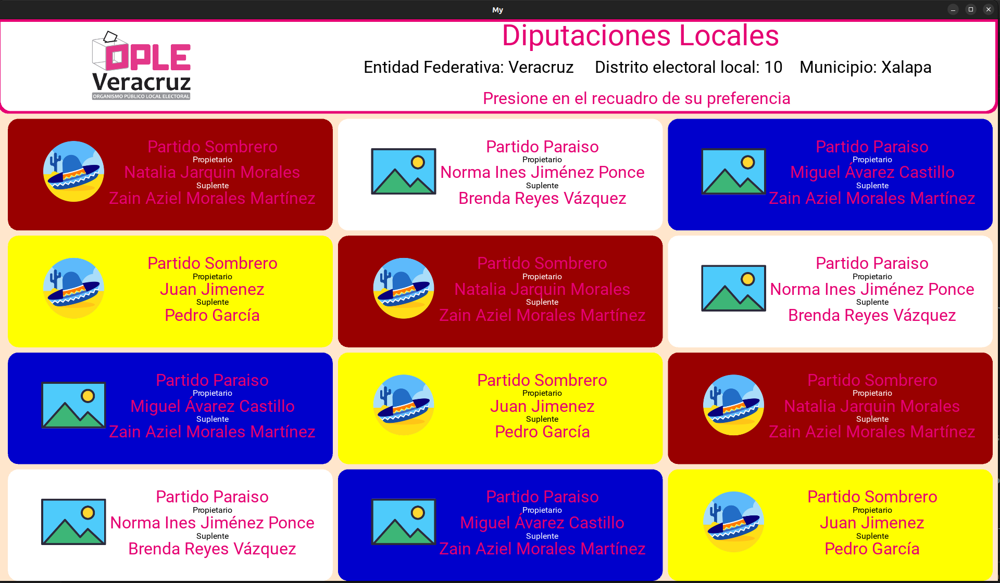
  <figcaption align="center">Interfaz de boleta para ejercer el voto</figcaption>
  </figure>

Cuando el votante haya elegido su opción recibirá un cuadro de confirmación. Tal como se muestra en la siguiente imagen. Siempre podrá regresar a la pantalla de la boleta mientras no esté seguro de su voto.

  <figure >    
    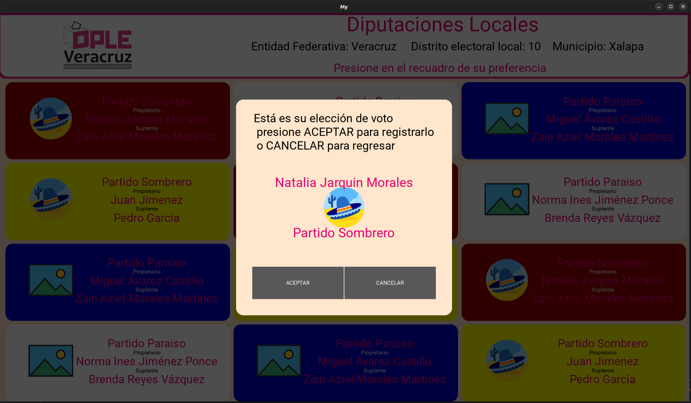
  <figcaption align="center">Confirmación del voto</figcaption>
  </figure>

Finalmente se muestra la capacidad multiplataforma tanto de Kivy como de python para ejecutarse en dispositivos móviles tanto Android como iOS. Esto permite que se puedan agregar tablets como urnas de emergencia, o a minorar costos para elecciones que requieran menos requisitos de seguridad como los contemplados para la las elecciones estatales y federales. Por ejemplo, para elecciones en escuelas o de carácter privado, podría ofrecerse esta opción, manteniendo todo el funcionamiento de la urna a nivel software.

  <figure >    
    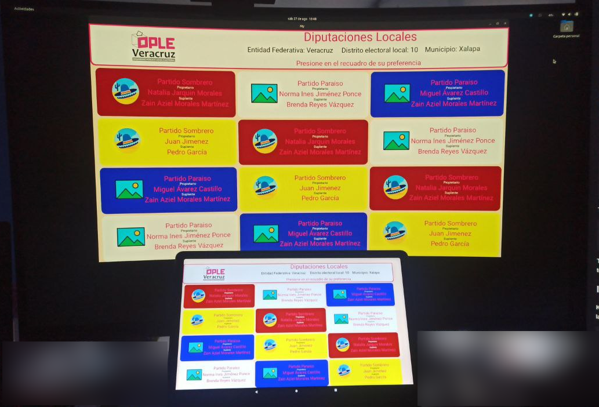
  <figcaption align="center">Multiplataforma</figcaption>
  </figure>

# Diseño y modelado de la urna

Se optó por un diseño cuadrado para que el transporte de la urna sea lo más cómodo posible dando una ventaja hacia los vehículos que transportan dichos artefactos y tengan la posibilidad de acomodar de manera que estas no reciban daños durante el trayecto. 
Cuenta con una pantalla en la parte superior que es desplegable lo que beneficia al momento de  guardarla y armarla de manera más sencilla; también protegiéndola de golpes, así como una pantalla táctil que es muy eficiente ya que es la pantalla principal donde se mostrará toda la información y el ciudadano solo tendrá que hacer sus selecciones con tan solo poner su dedo en el apartado que sea de su agrado. De igual manera al tener la funcionalidad de ser portátil la pantalla, resguardar de daños la parte trasera en la cual se encuentra la impresora térmica; además facilita el proceso de cambio de cartuchos o hacerle mantenimiento, se escogió que la impresora sea térmica ya que eso permite tener un ahorro en costos, únicamente comprando nuevos cartuchos de papel térmico a diferencia de las impresoras de tinta que necesitan cartuchos y ser rellenados continuamente.
El lector de tarjeta está ubicado en la parte izquierda de la pantalla principal únicamente mostrando lo necesario para que solo se deba  desplazar frente al lector de manera rápida y sin necesidad de algún contacto para posteriormente ser registrado el ciudadano; también se agrego un UPS en la parte inferior dentro de la urna para que las baterías no estén por fuera y de esa manera no estorben, también se implementó un cajón para poder acceder al UPS de manera mas cómoda y realizar reparaciones utilizando un mini pc para que la urna sea lo más compacta posible, está ubicada en la parte inferior a un lado del UPS y se decidió colocar abajo con la finalidad de no presentar problemas de espacio en la parte de las pantallas testigo y principal.
La urna cuenta con ventanas para que se pueda observar todas las fichas de los votantes y esto genere confianza en los ciudadanos puede ser de cristal templado o bien un acrílico para que tengan resistencia a golpes además se agregaron dos agarraderas para que su transporte sea fácil y así evitar caídas.
[//]: # "(Plano en 3D, Impresión en 4D, maqueta, dibujo isométrico, etc.), especificando material y dimensiones."

  <figure >
    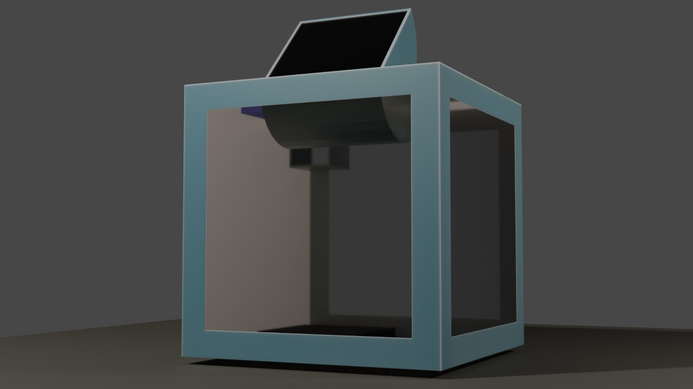
    

    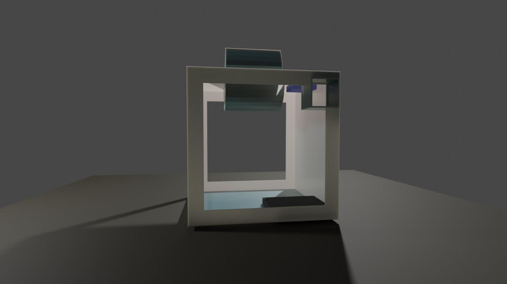
  <figcaption align="center">Vista frontal y trasera.</figcaption>
  </figure>

  <figure >
    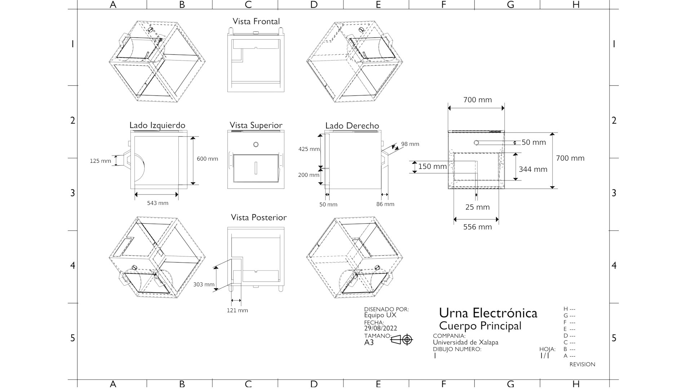
    <figcaption align="center">Cuerpo principal de la urna.</figcaption>
    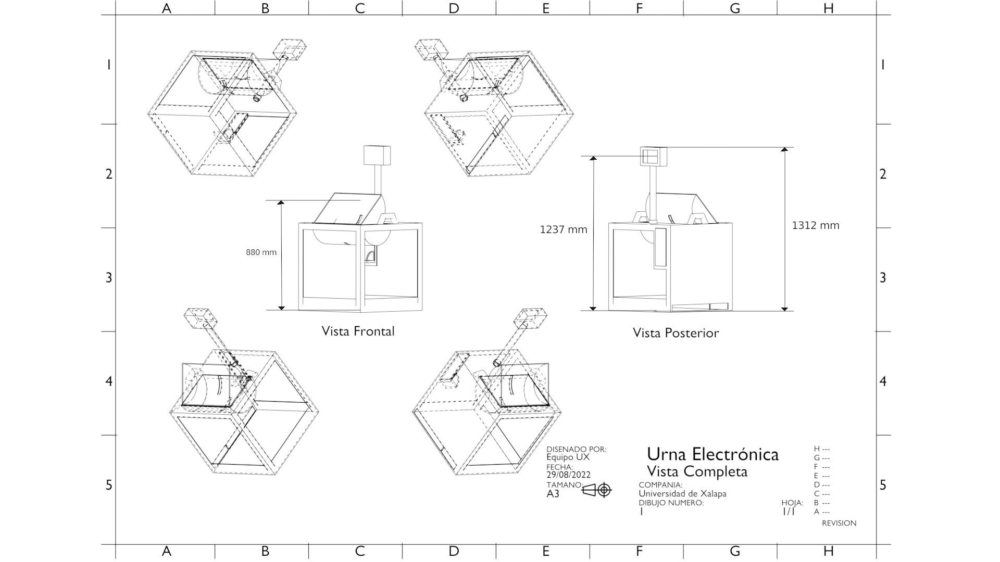
    <figcaption align="center">Vista completa.</figcaption>
    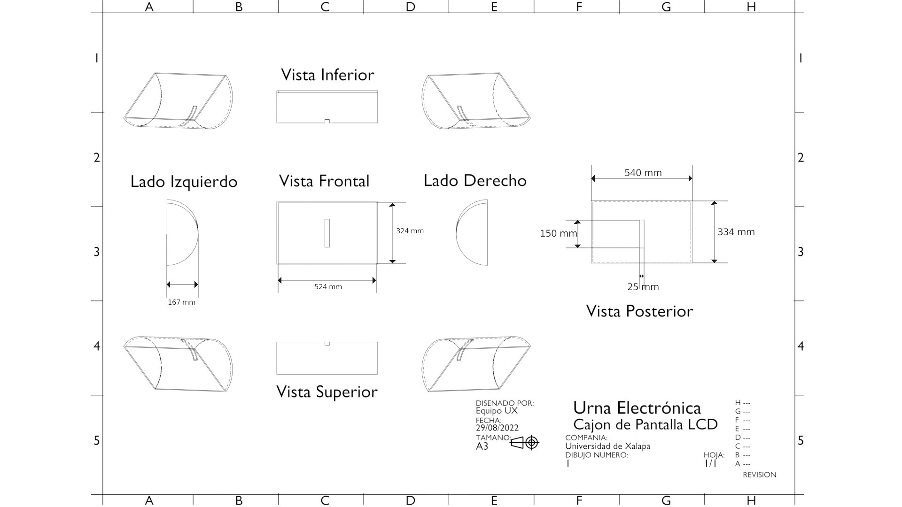
    <figcaption align="center">Cajón de pantalla LCD.</figcaption>
    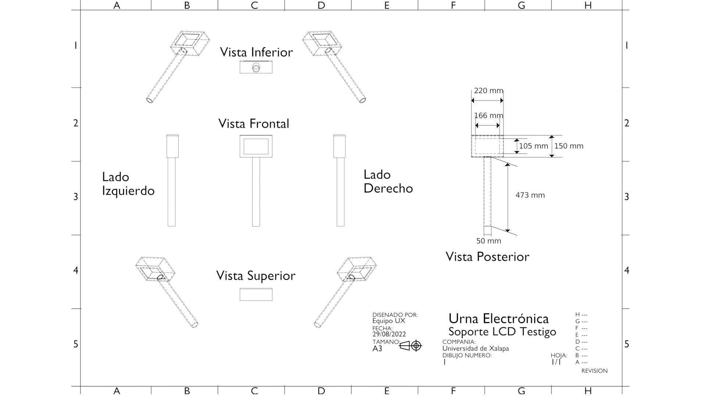
    <figcaption align="center">Soporte LCD Testigo.</figcaption>
  </figure>

# Referencias

- [1] https://www.iepcjalisco.org.mx/urna-electrónica/que-es-la-urna-electronica
- [2] International IDEA resources on Electoral Processes, “Introducing Electronic Voting: Essential Considerations”, International Institute fInternational IDEA resources on Electoral Processesor Democracy and Electoral Assistance, Sweden, ISBN: 978-91-86565-21-3, 2011
- [3] Alfonso Ayala Sánchez, EL VOTO ELECTRÓNICO EN EL MUNDO,2012, Universidad Nacional Autónoma de México, Instituto de Investigaciones Jurídicas, LXII Legislatura, H. Congreso del Estado de Veracruz
- [4] Sokolov, Roman & Arefin, S M. (2014). E-Voting evaluation report. 
- [5] Holovaty, A., & Kaplan-Moss, J. (2009). The definitive guide to Django: Web development done right. Apress.
- [6] Copperwaite, M., & Leifer, C. (2015). Learning flask framework. Packt Publishing.
- [7] Klever, N. (2013, abril). KIVY -A Framework for Natural User Interfaces [Diapositivas]. ResearchGate.
- [8] Domínguez, T. (2022). Desarrollo de interfaces gráficas en Python 3 con Tkinter (1.a ed.). Marcombo.
