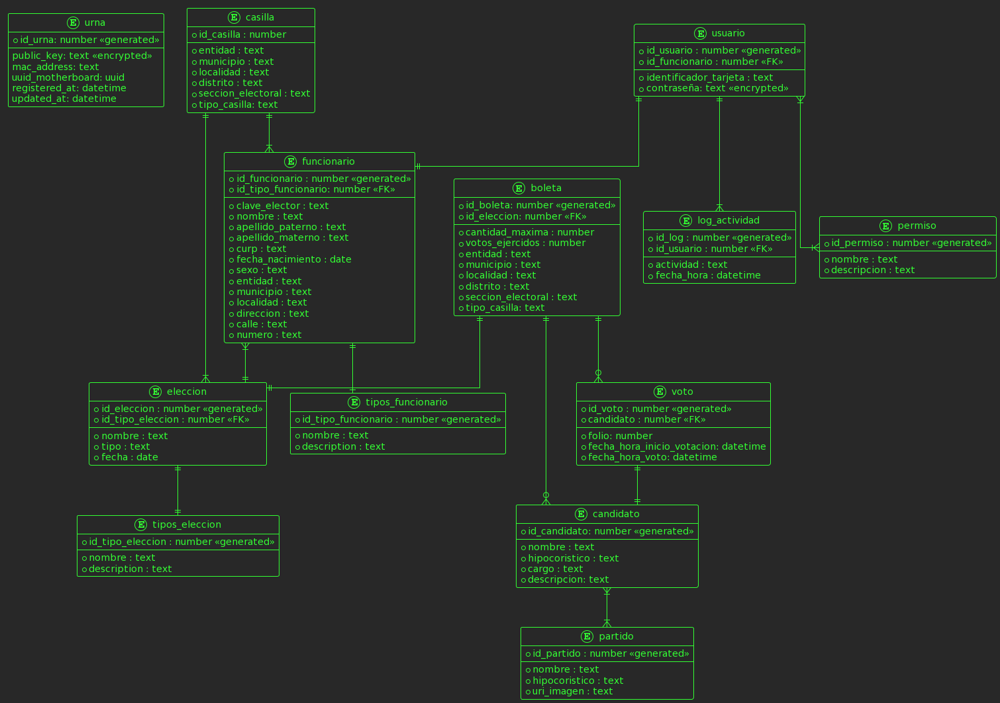

# Uxrna Electrónica

[//]: # "Institución educativa, líder del proyecto e integrantes del equipo."
[//]: # ""

  

# Universidad de Xalapa
***  

> "Till now, madness has been thought a small island in an ocean of sanity. I am beginning to suspect that it is not an island at all but a continent." -- [Machado de Assis](https://en.wikipedia.org/wiki/Machado_de_Assis), *[The Psychiatrist](https://en.wikipedia.org/wiki/O_alienista)*.

***
****** 
## Integrantes:
  - Ávarez Castillo Miguel
  - Jarquin Morales Natalia
  - Jiménez Ponce Norma Ines
  - Morales Martínez Zain Aziel
  - Reyes Vázquez Brenda
  - Aguilar Justo Adan Enrique (Disque el maestro responsable) 
  - Aguas con Yaser (Invitado Especial)

******

# Introducción

Algunos de los aspectos fundamentales del voto dentro de las democracias y en espacial en nuestro país, es que sea libre y secreto. El proceso
de votación le permite al ciudadano mexicano ejercer su máximo derecho de participación en la vida política, cívica y comunitaria del país. Sin embargo, las jornadas electorales son muy complejas y requieren de un especial cuidado durante cada momento del proceso, para lograr cumplir con los aspectos característicos
del voto, por lo tanto estas jornadas exigen mucho tiempo. Dado que la tecnología es una herramienta que  facilita muchas actividades ayudándonos a realizarlas de manera optima y eficaz, la tecnología se ha agregado en el proceso de votación y de esta manera se ha pensado en implementar una urna electrónica que permita el registro de los votos durante las jornadas electorales.

La urna electrónica es un dispositivo que permite recibir los votos emitidos por los ciudadanos y los contabiliza de manera automática [1]. De este modo la urna elimina el conteo manual de votos y consigo los posibles errores que se  pudieran generar en este conteo manual, aumentar la participación de la ciudadanía, ademas de que contribuye a la conservación del medio ambiente ya que esta urna es reusable.

En la actualidad con el avance de las tecnologías muchos países están en proceso de implementar nuevos mecanismos para dicho proceso, como la creación de urnas electrónicas.
Algunos países como Estados Unidos, Gran Bretaña, Suiza, Holanda, Estonia, Venezuela, Brasil, India, y Francia entre otros han implementado diversos mecanismos para que de esta forma los ciudadanos tengan mas confianza respecto a los procesos electorales, el término “e-voting” hace referencia a todo tipo de votación que implique el uso de medios electrónicos.
En Alemania las urnas electrónicas han sido utilizadas por más de diez años pero todo esto termino cuando la corte dicto que el uso de las urnas electrónicas queda prohibido ya que en 2005 los equipos presentaron problemas, el mas importante fue que los equipos no le ofrecían al ciudadano un comprobante que verificara que su voto había sido emitido lo que esto hizo que los ciudadanos desconfiaran totalmente en la máquina.

Como resultado en este trabajo se obtiene el diseño de un prototipo detallado de una urna electrónica funcional y segura. Se muestran las especificaciones de todos los componentes que conformarían el hardware de la urna, así mismo se mencionan los detalles del software, por consiguiente es posible ensamblar y programar la urna electrónica que se propone en este documento.

Esta urna electrónica diseñada por alumnos de la Universidad de Xalapa toma como base la cuarta generación de la urna electrónica de Jalisco, sin embargo las tecnologías utilizadas y planteadas para el prototipo son actuales y con un gran margen de escalamiento:

Para el sofware se eligieron las siguientes tecnologías, que son usadas por las FANG (Facebook, Amazon, Netflix, Google):

> - Lenguaje de programación python, que es de propósito general y permite desarrollar aplicaciones de manera rápida y eficiente.
> - Manejador de base de datos postgres, que es robusto y escalable.
> - Diseño del sistema utilizando modelos UML, que permiten una documentación rápida y descriptiva del proyecto.

El hardware utilizado es …
- MUY BREVE DESCRIPCIÓN DEL HARWARE

# Objetivos

> ## Objetivo General:
> * Desarrollar un prototipo eficaz de urna electrónica innovador y funcional, para que los ciudadanos puedan votar de una manera fácil, eficiente y segura. Enfocado para distintos tipos de elecciones, además de generar confianza en la ciudadanía.

> ## Objetivos específicos:
> * Proceso de votación fácil de comprender y realizar para el usuario.
> * Acortar el tiempo del proceso de votación.
> * Eliminar el conteo manual de votos.
> * Disminuir los costos que son generados por las boletas de papel utilizadas en las votaciones convencionales. 
> * Reducir el tiempo destinado a las capacitaciones de funcionarios de casilla.
> * Satisfacción en la ciudadanía al realizar el voto electrónico
> * Prototipo dentro del presupuesto dado.
> * Fomentar el voto electrónico.

# Glosario
  - **E-voting**: voto a distancia a través de internet
  - **Partido político**: son grupos de ciudadan@s que comparten una ideología política y la promueven 
  - **Presidente**: Es la persona designada para dirigir un gobierno, tribunal, asamblea, consejo, etc.
  - **Framework**: 
  - **Autenticación**:

# Especificaciones técnicas del prototipo

## Hardware

### SALUDOS Y BRENDA

## Software

### **Lenguajes de programación**

- **Java**: Es un lenguaje de programación ampliamente utilizado para codificar aplicaciones web. Java es un lenguaje multiplataforma, orientado a objetos y centrado en la red que se puede utilizar como una plataforma en sí mismo. Es un lenguaje de programación rápido, seguro y fiable para codificar todo, desde aplicaciones móviles y software empresarial hasta aplicaciones de macrodatos y tecnologías del lado del servidor.

- **PHP**: Es un lenguaje de programación que permite el desarrollo web o aplicaciones web dinámicas, el cual es apto para incrustar el lenguaje HTML, ahora bien, siempre siguiendo algunas reglas establecidas. 
Además, el lenguaje PHP favorece a la conexión entre el servidor y a la interfaz del usuario.

- **Python**: Es un lenguaje de programación de proposito general comúnmente utilizado para el desarrollo de aplicaciones web, investigación científica, aprendizaje automático y FinTech. Además, su código repetible y sus capacidades de automatización promueven procesos de construcción simplificados.

- **C#**: Es un lenguaje de programación orientado a objetos orientado a componentes. C# proporciona construcciones de lenguaje para admitir directamente estos conceptos, por lo que se trata de un lenguaje natural en el que crear y usar componentes de software.
C# permite a los desarrolladores crear muchos tipos de aplicaciones seguras y sólidas que se ejecutan en .NET.

|                 | **Java**                                        | **PHP**                                                 | **Python**                                   | **C#**                                                       |
| --------------- | :---------------------------------------------- | :------------------------------------------------------ | :------------------------------------------- | ------------------------------------------------------------ |
| **Ventajas**    | Curva de aprendizaje alta                       | Lenguaje libre                                          | Baja curva de aprendizaje                    | Un Lenguaje Seguro                                           |
|                 | Está orientado a los objetos                    | Dispone de una sintaxis muy limpia                      | Polivalente y de paradigmas                  | Orientado a Objetos                                          |
|                 | Es multiplataforma                              | Se integra de una manera muy simple en la base de datos | Amplia colección de bibliotecas y frameworks | Más Sencillo que C++                                         |
|                 | Cuenta con liberación de memoria                |                                                         | Portabilidad                                 | Seguro pero flexible                                         |
|                 |                                                 |                                                         | Gratis y de código abierto                   | Mejor Manejo de Memoria                                      |
| **Desventajas** | Es de lenguaje Interpretado                     | Brechas de seguridad que puede haber en el servidor     | Lentitud                                     | Se debe conseguir una versión reciente de Visual Studio .NET |
|                 | Requiere de experiencia en programación         | El código fuente no se puede ocultar con facilidad      | Consumo de memoria                           | Alta curva de aprendizaje                                    |
|                 | Es de sintaxis compleja                         | Para su ejecución, es necesario un servidor             | Desarrollo móvil                             | Requisitos de computo altos                                  |
|                 | Se ejecuta solo en dispositivos y equipos aptos |                                                         |                                              |                                                              |

Para el proyecto de la urna electronica se propone utilizar **python** como lenguaje base. En los últimos años python ha evolucionado para ser uno de los lenguajes preferidos en la industria de desarrollo de software e investigación en inteligencia artificial. Por lo cúal se han desarrollado multiples franworks que permiten trabajar desde aplicaciones de escritorio hasta aplicaciones web para el backend de estas. Dentro de los frameworks explorados encontramos:

> - **[Flask](https://flask.palletsprojects.com/)**: es un framework minimalista para el desarrollo de aplicaciones web de manera rapida y con muy pocas lineas de codigo.
> - **[Django](https://www.djangoproject.com/)**: es un framework web de alto nivel que fomenta un desarrollo rápido y un diseño limpio y pragmático. Este es mas avanzado que flask.
> - **[Kivy](https://kivy.org/)**: es un framework Python gratuito y de código abierto para desarrollar aplicaciones móviles y otro software de aplicación multitáctil con una interfaz de usuario natural. Se distribuye bajo los términos de la licencia MIT y puede ejecutarse en Android, iOS, Linux, macOS y Windows.
> - **[Tkinter](https://docs.python.org/es/3/library/tkinter.html)**: es una libreria de Python y funciona para la creación y desarrollo de interfaces 
gráficas de usuario, es rápido y fácil de programar aunque su documentación estándar es débil

Para el servidor web se eligío utilizar DJANGO, mientras que para la aplicacíon que vivira en la urna sera desarrollada con KIVY para la interfaz gráfica.

### **¿Por qué Kivy?**
- Es exportable a dispositivos móviles.
- Multiplataforma, es decir, funciona en varios sistemas operativos o dispositivos ya que
 puede ejecutarse en iOS, Android, Windows, OS X y GNU / Linux
- Widgets fáciles de usar construidos con soporte multitáctil.
- Funciona mejor que las alternativas multiplataforma de HTML5.
- Orientada a generar prototipos de manera rápida y con diseños eficientes que favorecen
 códigos re-utilizables y de fácil despliegue.
- Permitiendo incluso crear urnas portatiles en dispositivos moviles como tabletas electronicas.

### **Manejador de base de datos**

Un sistema manejador de base de datos es un software utilizado para gestionar, almacenar y recuperar bases de datos también optimiza la organización de los datos mediante una técnica de esquema llamada normalización, estos funcionan mediante comandos de sistema, estos cuentan con un administrador que recibe los comandos y da las instrucciones para recuperar, guardar o modificar los datos.

Para el trabajo en la parte de software en el manejo de bases de datos nuestras opciones fueron MySQL, MariaDB, PostgreSQL y SQLite.

> - **MYSQL**: Es el manejador de bases de datos más usado, fue diseñado para bases de datos grandes se basa en SQL y en la arquitectura cliente-servidor, es el sistema de gestión de datos mas utilizado por su compatibilidad con varias plataformas informáticas como Linux, Windows y macOS, también es compatible con lenguajes de programación como C, C++, Java, Perl, PHP, Python y Ruby, MySQL  es de código abierto lo que implica que puede ser modificado bajo los términos de la licencia pero si es necesario la versión con licencia para usarlo en aplicaciones comerciales.
> - **MARIADB**: Es un manejador de datos que tiene parecido con MySQL ya que fue desarrollado por uno de sus desarrolladores, este también es un software libre lo que mas destaca de este software es que puede remplazar a los programas que funcionan con MySQL.
> - **POSTGRESQL**: Es un sistema de bases relacionales libre y de código abierto aparte de que ofrece una gran cantidad de opciones avanzadas por lo que es considerado el mejor manejador de bases de datos en la actualidad.
> - **SQLite**: Es un software libre que permite almacenar información en dispositivos de manera sencilla, eficaz, potente y rápida en equipos de pocas capacidades de hardware, como lo puede ser un teléfono, SQLite implementa el estándar sql92 y también agrega extensiones que facilitan el uso de cualquier ambiente de desarrollo lo que permite que pueda soportar consultas básicas hasta otras más complejas, también lo mas importante es que puede ser usado tanto en dispositivos móviles como el dispositivos de escritorio todo gracias a que cuenta con compatibilidad.

Para el proyecto de la urna electrónica se propone usar PostgreSQL y SQLite el primero es una muy buena opción ya que PostgreSQL es un software que trabaja mejor con bases de datos grandes y como la urna esta planeada con el objetivo de registrar todos los votos de la población será una muy buena opción para manejar los datos de votos, también se propone el uso de SQLite por ser un programa muy ligero que puede funcionar en cualquier tipo de equipos con poca capacidad de hardware  por lo que si se desea crear urnas digitales en dispositivos más pequeños como móviles o tabletas electrónicas nos brindara un desempeño. 

### **Arquitecura Cliente-Servidor**

La arquitectura cliente-servidor es un modelado de sistemas, donde las tareas se reparten entre proveedores de recursos o servicios, llamados servidores y los consumidores llamados clientes.

Para la urna electrónica se propone utilizar esta arquitectura, donde habrá un servidor que proveerá de la configuración inicial a las urnas electrónicas, y las urnas electrónicas que mantendrán una copia de la información requerida para su funcionamiento, la cual obtendrán del servidor central, a quien también le comunicaran los resultados finales, ya sea a través de internet o de una red local privada. El siguiente diagrama muestra la arquitectura y la comunicación de cada una de las partes. 
 

<figure>
  
  <figcaption>Diagrama componentes de cliente-servidor, se puede observar que el cliente utilizará SQLite para el almacenamiento de datos, mientras que el servidor Postgres, para gestionar multiples urnas.</figcaption>
</figure>

### **Diseño de datos**

El sistema de la urna electrónica requiere almacenar información para su correcto funcionamiento, en el siguiente diagrama se muestra el diseño de la estructura de los datos y su relación entre ellos. Entre las entidades más relevantes podemos ver, los datos generales de las Casillas, los funcionarios y la boleta, donde se almacenará el conteo de los votos, se modela el candidato y su relación con multiples partidos.

<figure>
  
    <figcaption>Diagrama relacional para mantener la información necesaria para el funcionamiento de </figcaption>
</figure>

A contniuación se describe cada una de las entidades y sus atributos:

> **Urna**: Esta entidad será la encargada en el servidor de alamacenar todas las urnas registradas y autorizadas a recibir o enviar información. Mientras que en la urna, alamacenará su información para solicitar los accesos pertinentes.
>  - id_urna: number \<<generated\>>: Identificador númerico de la urna, único para cada urna.
>  - public_key: text \<<encrypted\>>: Llave publica, para poder encryptar y desencryptar los mensajes, también se puede usar para verificar la identidad de la urna.
>  ---
>  - mac_address: text: Dirección MAC del dispositivo de red unico en el mundo para el dispositivo colocado, usuado para la autenticación junto con la llave publica y el uudi de la tarjeta madre.
>  - uuid_motherboard: uuid: Identificador único de la tarjeta madre utilizada en la urna, es asignado por el fabricante y también se usa para identificar la urna.
>  - registered_at: datetime: Fecha en que la urna se registra en el sistema principal.
>  - updated_at: datetime: Fecha de ultima actualización de la urna. Puede ser cuando se configuro o cuando se reinicio.

> **Casilla**: Almacenará la información de la casilla a la que fue asignada la urna.
>    * id_casilla : number \<<generated\>>: Identificador númerico único de registro de la casilla.
>    ---
>    * entidad : text: Entidad federativa donde se instalara la casilla.
>    * municipio : text: Municio donde se instalara la casilla.
>    * localidad : text: Localidad donde se instalara la casilla.
>    * distrito : text: Distrito al que pertenece la casilla.
>    * seccion_electoral : text: Sección de la casilla.
>    * tipo_casilla: text: Tipo de casilla.

> **Usuario**: Entidad encargada de alamacenar la información de los usuarios que pueden acceder a algún tipo de configuración de la urna.
>    * id_usuario : number \<<generated\>>: Identificador númerico único del usuario.
>    * id_funcionario : number \<<FK\>>: Los funcionarios son aquellos primeros usaurios que seran registrados (tienen una entidad para sus datos propia)
>    ---
>    * identificador_tarjeta : text: Identificador de tarjeta para su acceso.
>    * contraseña: text \<<encrypted\>>: Contraseña para el ingreso en caso de que la tarjeta no funcione, está se encontrara encriptada.

> **Permiso**: Almacena el nivel de acceso de los usuarios, ya que no todos los usuarios tiene permiso de realizar todas las actividades.
>    * id_permiso : number \<<generated\>>: Identificador númerico único de los permisos.
>    ---
>    * nombre : text: Nombre del permiso. (ej. SuperUsuario)
>    * descripcion : text: Descripción larga del permiso registrado.

> **Funcionario**: Datos de los funcionarios de casilla.
>    * id_funcionario : number <<generated>>: Identificador númerico único.
>    * id_tipo_funcionario: number <<FK>>: Tipo de funcionario, categoría o cargo.
>    ---
>    * clave_elector : text: Clave de elector del funcionario, debe ser un ciudadano.
>    * foto_funcionario: text: Foto para identificar al funcionario físicamente.
>    * nombre : text: Nombre o nombres del funcionario.
>    * apellido_paterno : text: Apellido paterno del funcionario.
>    * apellido_materno : text: Apellido materno del funcionario.
>    * curp : text: Clave única de registro de población del funcionario.
>    * fecha_nacimiento : date: fecha de nacimiento del funcionario.
>    * sexo : text: Sexo del funcionario.
>    * entidad : text: Entidad federativa donde vive el funcionario.
>    * municipio : text: Municipio donde vive el funcionario.
>    * localidad : text: Localidad donde vive el funcionario.
>    * direccion : text: Direccion donde vive el funcionario.
>    * calle : text: Calle donde vive el funcionario.
>    * numero : text: Número de casa donde vive el funcionario.

> **Tipos funcionario**: Catalogo de la información de los diferentes tipos de funcionario.
>    * id_tipo_funcionario : number \<<generated\>>: Identificador númerico único.
>    --
>    * nombre : text: Nombre del cargo/tipo/categoría del funcionario.
>    * description : text: Descripción larga del tipo de funcionario.

> **Eleccion**: 
>    * id_eleccion : number <<generated>>: Identificador númerico único.
>    * id_tipo_eleccion : number <<FK>>: Identificador del tipo de elección que se esta ejecutando.
>   ---
>    * nombre : text: Nombre de la elección.
>    * tipo : text: Tipo de elección.
>    * fecha : date: Fecha en la que se debe llevar a cabo la elección.

> **Tipos eleccion**: Catalogo de tipos de elección.
>    * id_tipo_eleccion : number <<generated>>: Identificador númerico único.
>    --
>    * nombre : text: Nombre del tipo de elección.
>    * description : text: Descripción larga del tipo de elección.

> **Boleta**: LLeva el conteo de los votos y la estructura de las boletas que se mostraran en pantalla.
>    * id_boleta: number <<generated>>: Identificador númerico único.
>    * id_eleccion : number <<FK>>: Identificador de la elección a la que pertenece la boleta.
>    --
>    * cantidad_maxima : number: Cantidad máxima de boletas que deben mostrarse ( en caso de que exista un limite, 0 para sin límite)
>    * votos_ejercidos : number: contador de votos ejercidos sobre esta configuración de boleta.
>    * entidad : text: Entidad para la que esta configurada la boleta.
>    * municipio : text: Municipio para la que esta configurada la boleta.
>    * localidad : text: Localidad para la que esta configurada la boleta.
>    * distrito : text: Distrito para la que esta configurada la boleta.
>    * seccion_electoral : text: Seccion para la que esta configurada la boleta.
>    * tipo_casilla: text: Tipo de casilla a la que pertenece la boleta.

> **Voto**: Registro del voto, no se registra quien vota.
>    * id_voto : number <<generated>>: Identificador númerico único.
>    * candidato : number <<FK>>: Identifiador del candidato que selecciono el votante.
>    ---
>    * folio: number: Numero consecutivo generado para mantener el orden de los votos.
>    * fecha_hora_inicio_votacion: datetime: Tiempo de inicio del proceso de votación.
>    * fecha_hora_voto: datetime: Momento en que se registro el voto.

> **Candidato**: Información de los candidatos para cada tipo de elección.
>    * id_candidato: number <<generated>>: Identificador númerico único.
>    ---
>    * nombre : text: Nombre completo del candidato.
>    * hipocoristico : text: Abreviación del partido/coalición del candidato.
>    * cargo : text: Cargo al que se postula el candidato.
>    * descripcion: text: Descripción larga del candiadato, pueden agregarse observaciones.

> **Partido**: Partidos o grupos politicos/sociales que son representados por el candidato.
>    * id_partido : number <<generated>>: Identificador númerico único.
>   ---
>    * nombre : text: Nombre del partido.
>    * hipocoristico : text: Abreviación del partido/coalición/grupo.
>    * uri_imagen : text: Imagen del partido para identificación visual.

> **Log actividad**: Registro de la actividad de los usuarios de la urna. Se usara como información auditable.
>    * id_log : number <<generated>>: Identificador númerico único.
>    * id_usuario : number <<FK>>: Identificador del usuario que realiza la acción.
>    --
>    * actividad : text: Actividad que realizó el usuario.
>    * fecha_hora : datetime: Hora y fecha en que el usuario realizó la actividad.

Este modelo contempla lo mínimo necesario para el correcto funcionamiento de la urna, además de ser flexible para diferentes tipos de elección a diferentes rubros sociales.

### **Diseño de interfaz de usuario**

  
  

# Diseño y modelado de la urna
[//]: # "(Plano en 3D, Impresión en 4D, maqueta, dibujo isométrico, etc.), especificando material y dimensiones."

VISTAS... 

  

  

# Anexos: documentación de diseño del sistema

# Referencias

- [1] https://www.iepcjalisco.org.mx/urna-electrónica/que-es-la-urna-electronica
- [2] International IDEA resources on Electoral Processes, “Introducing Electronic Voting: Essential Considerations”, International Institute fInternational IDEA resources on Electoral Processesor Democracy and Electoral Assistance, Sweden, ISBN: 978-91-86565-21-3, 2011
- [3] Alfonso Ayala Sánchez, EL VOTO ELECTRÓNICO EN EL MUNDO,2012, Universidad Nacional Autónoma de México, Instituto de Investigaciones Jurídicas, LXII Legislatura, H. Congreso del Estado de Veracruz
- [4] Sokolov, Roman & Arefin, S M. (2014). E-Voting evaluation report. 
- [5] Holovaty, A., & Kaplan-Moss, J. (2009). The definitive guide to Django: Web development done right. Apress.
- [6] Copperwaite, M., & Leifer, C. (2015). Learning flask framework. Packt Publishing.
- [7] Klever, N. (2013, abril). KIVY -A Framework for Natural User Interfaces [Diapositivas]. ResearchGate.
- [8] Domínguez, T. (2022). Desarrollo de interfaces gráficas en Python 3 con Tkinter (1.a ed.). Marcombo.
